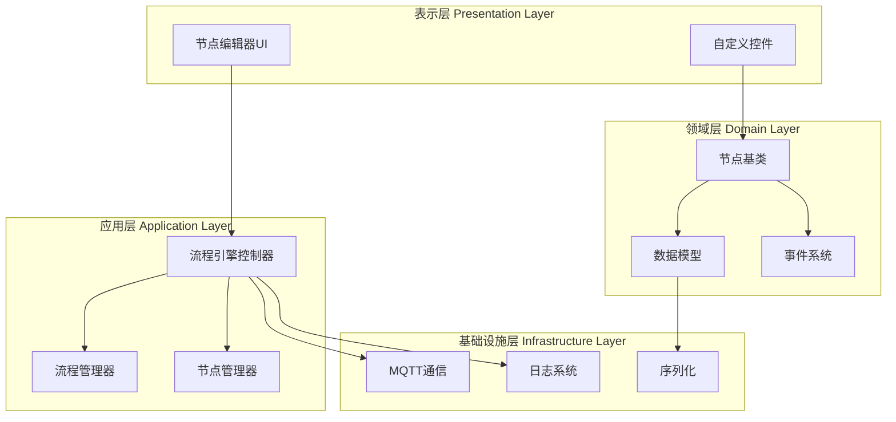
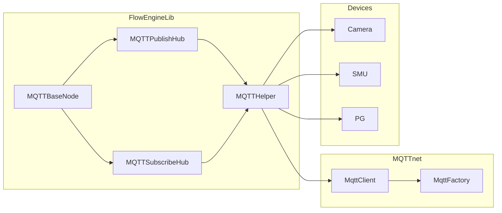
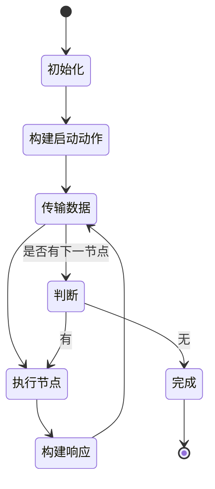
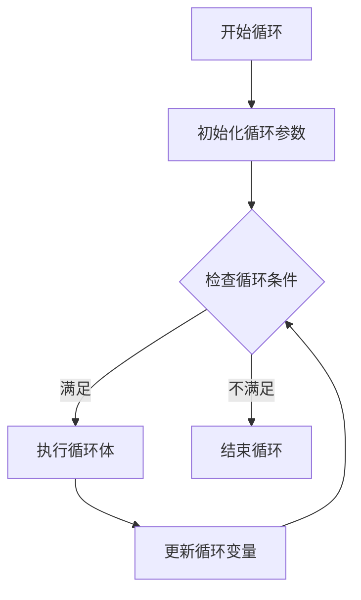
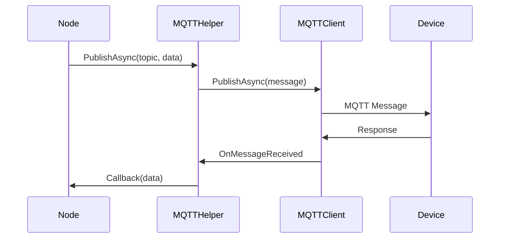
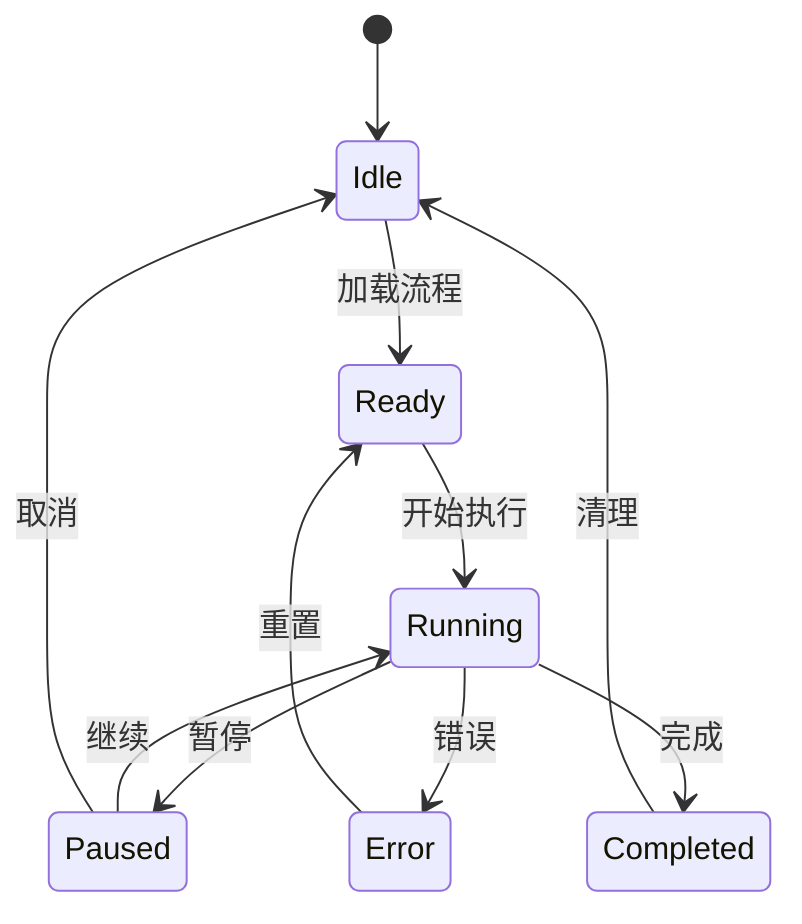

# FlowEngineLib 架构设计文档

> FlowEngineLib 的核心架构设计和技术实现详解

## 📋 目录

- [架构概览](#架构概览)
- [核心设计模式](#核心设计模式)
- [模块划分](#模块划分)
- [数据流设计](#数据流设计)
- [通信架构](#通信架构)
- [执行引擎](#执行引擎)
- [扩展机制](#扩展机制)
- [性能设计](#性能设计)

## 架构概览

### 总体架构

FlowEngineLib 采用分层架构设计，主要分为以下几层：



### 技术栈层次

```
┌─────────────────────────────────────┐
│     UI Layer (WinForms)             │
│  ST.Library.UI.NodeEditor           │
├─────────────────────────────────────┤
│     Business Logic Layer            │
│  FlowEngineControl, NodeManager     │
├─────────────────────────────────────┤
│     Domain Model Layer              │
│  Node Types, Data Models, Events    │
├─────────────────────────────────────┤
│     Infrastructure Layer            │
│  MQTT, Logging, Serialization       │
├─────────────────────────────────────┤
│     Framework Layer                 │
│  .NET 8.0 / .NET Framework 4.7.2    │
└─────────────────────────────────────┘
```

## 核心设计模式

### 1. 模板方法模式

节点基类定义了执行流程的模板，子类实现具体步骤。

```csharp
// 抽象基类定义模板
public abstract class CVBaseServerNode : CVCommonNode
{
    // 模板方法
    public void Execute(CVStartCFC cfc)
    {
        OnBeforeExecute(cfc);
        DoServerWork(cfc);        // 抽象方法，子类实现
        OnAfterExecute(cfc);
        DoTransferData(m_op_data_out, cfc);
    }
    
    // 抽象方法
    protected abstract void DoServerWork(CVStartCFC cfc);
    
    // 钩子方法
    protected virtual void OnBeforeExecute(CVStartCFC cfc) { }
    protected virtual void OnAfterExecute(CVStartCFC cfc) { }
}
```

**优势**：
- 统一执行流程
- 灵活扩展具体实现
- 易于维护和测试

### 2. 策略模式

用于算法节点的算法选择。

```csharp
public interface IAlgorithmStrategy
{
    AlgorithmResult Execute(ImageData image, Dictionary\\<string, object\> parameters);
}

public class EdgeDetectionStrategy : IAlgorithmStrategy
{
    public AlgorithmResult Execute(ImageData image, Dictionary\\<string, object\> parameters)
    {
        // 边缘检测实现
    }
}

public class AlgorithmNode : CVBaseServerNode
{
    private Dictionary\\<string, IAlgorithmStrategy\> _strategies;
    
    protected override void DoServerWork(CVStartCFC cfc)
    {
        var strategy = _strategies[AlgorithmType];
        var result = strategy.Execute(imageData, parameters);
    }
}
```

### 3. 观察者模式

用于事件通知机制。

```csharp
// 事件发布者
public class BaseStartNode : CVCommonNode
{
    public event FlowStartEventHandler Finished;
    
    protected void RaiseFinished(FlowStartEventArgs args)
    {
        Finished?.Invoke(this, args);
    }
}

// 事件订阅者
flowEngine.Finished += (sender, args) => {
    Console.WriteLine($"Flow {args.FlowName} completed");
};
```

### 4. 单例模式

用于全局管理器。

```csharp
public class FlowNodeManager
{
    private static FlowNodeManager _instance;
    private static readonly object _lock = new object();
    
    public static FlowNodeManager Instance
    {
        get
        {
            if (_instance == null)
            {
                lock (_lock)
                {
                    if (_instance == null)
                    {
                        _instance = new FlowNodeManager();
                    }
                }
            }
            return _instance;
        }
    }
}
```

### 5. 工厂模式

用于节点创建。

```csharp
public class NodeFactory
{
    private Dictionary\\<string, Type\> _nodeTypes;
    
    public STNode CreateNode(string nodeTypeName)
    {
        if (_nodeTypes.TryGetValue(nodeTypeName, out Type nodeType))
        {
            return (STNode)Activator.CreateInstance(nodeType);
        }
        throw new NotSupportedException($"Node type {nodeTypeName} not found");
    }
    
    public void RegisterNodeType\<T\>() where T : STNode
    {
        var attr = typeof(T).GetCustomAttribute\<STNodeAttribute\>();
        if (attr != null)
        {
            _nodeTypes[attr.Path] = typeof(T);
        }
    }
}
```

### 6. 责任链模式

用于节点间的数据传递。

```mermaid
sequenceDiagram
    participant Start as StartNode
    participant Node1 as Node1
    participant Node2 as Node2
    participant End as EndNode
    
    Start->>Node1: DoTransferData(CFC)
    Node1->>Node1: DoServerWork()
    Node1->>Node2: DoTransferData(CFC)
    Node2->>Node2: DoServerWork()
    Node2->>End: DoTransferData(CFC)
    End->>Start: RaiseFinished()
```

## 模块划分

### 1. 核心模块

#### FlowEngineControl
- **职责**: 流程引擎主控制器
- **功能**: 
  - 管理流程生命周期
  - 节点编辑器集成
  - 流程执行控制

#### FlowNodeManager
- **职责**: 节点管理
- **功能**:
  - 节点注册和发现
  - 设备节点管理
  - 节点状态同步

#### FlowServiceManager
- **职责**: 服务管理
- **功能**:
  - MQTT服务管理
  - 服务状态维护
  - 服务查找

### 2. 节点模块

#### 节点类层次

```
STNode (ST.Library.UI)
└── CVCommonNode
    ├── BaseStartNode
    │   ├── MQTTStartNode
    │   └── ModbusStartNode
    ├── CVBaseServerNode
    │   ├── CVCameraNode
    │   ├── AlgorithmNode
    │   ├── SMUNode
    │   ├── MotorNode
    │   └── CVBaseLoopServerNode
    │       └── PGLoopNode
    ├── CVEndNode
    └── LoopNode
```

#### 节点职责分离

| 节点类型 | 职责 | 特点 |
|---------|------|------|
| StartNode | 流程入口 | 管理流程上下文，触发流程 |
| ServerNode | 业务执行 | 执行具体业务逻辑 |
| LoopNode | 循环控制 | 管理循环状态和迭代 |
| EndNode | 流程结束 | 收集结果，清理资源 |

### 3. 通信模块

#### MQTT通信架构



#### 主题设计

```
服务类型/{设备代码}/消息类型
├── Camera/CAM001/cmd          # 相机命令
├── Camera/CAM001/resp         # 相机响应
├── Camera/CAM001/data         # 相机数据
├── SMU/SMU001/cmd            # SMU命令
├── SMU/SMU001/resp           # SMU响应
└── Algorithm/ALG001/result   # 算法结果
```

### 4. 数据模块

#### 数据流对象

```csharp
// 流程控制对象
public class CVStartCFC
{
    public string NodeName { get; set; }
    public string SerialNumber { get; set; }
    public string FlowName { get; set; }
    public object Params { get; set; }
    public string EventName { get; set; }
}

// 传输动作对象
public class CVTransAction
{
    public ActionTypeEnum ActionType { get; set; }
    public object Data { get; set; }
    public StatusTypeEnum Status { get; set; }
}

// 循环控制对象
public class CVLoopCFC
{
    public string NodeName { get; set; }
    public string SerialNumber { get; set; }
    public int LoopIndex { get; set; }
    public object LoopData { get; set; }
}
```

#### 数据模型设计原则

1. **不可变性**: 关键数据对象采用不可变设计
2. **序列化友好**: 支持JSON序列化
3. **类型安全**: 强类型定义
4. **扩展性**: 使用Dictionary\\<string, object\>支持动态属性

## 数据流设计

### 1. 流程执行数据流



### 2. 循环执行数据流



### 3. MQTT数据流



## 通信架构

### 1. MQTT通信层次

```
应用层 (Node)
    ↓
抽象层 (MQTTHelper)
    ↓
协议层 (MQTTnet)
    ↓
传输层 (TCP/TLS)
```

### 2. 消息格式

#### 命令消息
```json
{
  "Version": "1.0",
  "MsgID": "12345",
  "Command": "Capture",
  "Params": {
    "ExposureTime": 1000,
    "Gain": 10
  },
  "Timestamp": "2024-01-01T12:00:00"
}
```

#### 响应消息
```json
{
  "Version": "1.0",
  "MsgID": "12345",
  "Code": 0,
  "Message": "Success",
  "Data": {
    "ImagePath": "/path/to/image.png",
    "Width": 1920,
    "Height": 1080
  },
  "Timestamp": "2024-01-01T12:00:01"
}
```

### 3. QoS策略

| QoS级别 | 使用场景 | 特点 |
|--------|---------|------|
| 0 | 状态上报 | 不保证送达，性能最高 |
| 1 | 一般命令 | 至少送达一次 |
| 2 | 关键命令 | 确保送达且仅一次 |

## 执行引擎

### 1. 执行流程

```csharp
public class FlowExecutor
{
    public async Task\<FlowResult\> ExecuteAsync(
        string flowName,
        CVStartCFC startCFC,
        CancellationToken ct)
    {
        try
        {
            // 1. 查找启动节点
            var startNode = FindStartNode(flowName);
            
            // 2. 构建执行上下文
            var context = BuildContext(startCFC);
            
            // 3. 执行流程
            await ExecuteFlowAsync(startNode, context, ct);
            
            // 4. 收集结果
            return CollectResults(context);
        }
        catch (Exception ex)
        {
            logger.Error($"Flow {flowName} execution failed", ex);
            return FlowResult.Failed(ex.Message);
        }
    }
    
    private async Task ExecuteFlowAsync(
        BaseStartNode startNode,
        FlowContext context,
        CancellationToken ct)
    {
        // 递归执行节点链
        var currentNode = startNode;
        while (currentNode != null && !ct.IsCancellationRequested)
        {
            await currentNode.ExecuteAsync(context);
            currentNode = GetNextNode(currentNode, context);
        }
    }
}
```

### 2. 并发控制

```csharp
public class ConcurrentFlowManager
{
    private readonly SemaphoreSlim _semaphore;
    private readonly ConcurrentDictionary\\<string, FlowContext\> _runningFlows;
    
    public ConcurrentFlowManager(int maxConcurrent)
    {
        _semaphore = new SemaphoreSlim(maxConcurrent, maxConcurrent);
        _runningFlows = new ConcurrentDictionary\\<string, FlowContext\>();
    }
    
    public async Task\<FlowResult\> RunFlowAsync(
        string flowName,
        CancellationToken ct)
    {
        await _semaphore.WaitAsync(ct);
        try
        {
            var context = CreateContext(flowName);
            _runningFlows[flowName] = context;
            
            return await ExecuteFlowAsync(context, ct);
        }
        finally
        {
            _runningFlows.TryRemove(flowName, out _);
            _semaphore.Release();
        }
    }
}
```

### 3. 状态机设计



## 扩展机制

### 1. 节点注册机制

```csharp
public class NodeRegistry
{
    private readonly Dictionary\\<string, NodeDescriptor\> _nodes;
    
    // 自动发现并注册节点
    public void ScanAndRegisterNodes(Assembly assembly)
    {
        var nodeTypes = assembly.GetTypes()
            .Where(t => t.IsSubclassOf(typeof(STNode)) && !t.IsAbstract);
            
        foreach (var type in nodeTypes)
        {
            var attr = type.GetCustomAttribute\<STNodeAttribute\>();
            if (attr != null)
            {
                RegisterNode(new NodeDescriptor
                {
                    Type = type,
                    Path = attr.Path,
                    Category = GetCategory(attr.Path)
                });
            }
        }
    }
    
    // 手动注册节点
    public void RegisterNode\<T\>() where T : STNode
    {
        // 注册逻辑
    }
}
```

### 2. 插件系统

```csharp
public interface IFlowPlugin
{
    string Name { get; }
    string Version { get; }
    void Initialize(IFlowEngine engine);
    void RegisterNodes(NodeRegistry registry);
}

public class PluginLoader
{
    public void LoadPlugin(string pluginPath)
    {
        var assembly = Assembly.LoadFrom(pluginPath);
        var pluginTypes = assembly.GetTypes()
            .Where(t => typeof(IFlowPlugin).IsAssignableFrom(t));
            
        foreach (var type in pluginTypes)
        {
            var plugin = (IFlowPlugin)Activator.CreateInstance(type);
            plugin.Initialize(flowEngine);
            plugin.RegisterNodes(nodeRegistry);
        }
    }
}
```

### 3. 扩展点

| 扩展点 | 接口 | 说明 |
|-------|------|------|
| 节点类型 | STNode | 自定义节点 |
| 算法策略 | IAlgorithmStrategy | 自定义算法 |
| 数据源 | IDataSource | 自定义数据源 |
| 通信协议 | IProtocol | 自定义协议 |
| 序列化器 | ISerializer | 自定义序列化 |

## 性能设计

### 1. 内存优化

#### 对象池
```csharp
public class ObjectPoolManager
{
    private static readonly ObjectPool\<CVStartCFC\> CFCPool = 
        ObjectPool.Create\<CVStartCFC\>();
        
    private static readonly ObjectPool<byte[]> BufferPool = 
        ObjectPool.Create(() => new byte[8192]);
    
    public static CVStartCFC RentCFC() => CFCPool.Get();
    public static void ReturnCFC(CVStartCFC cfc) => CFCPool.Return(cfc);
}
```

#### 大对象处理
```csharp
public class ImageProcessor
{
    public unsafe void ProcessImage(Span\<byte\> imageData)
    {
        // 使用Span避免数组复制
        fixed (byte* ptr = imageData)
        {
            // 处理图像
        }
    }
}
```

### 2. 并发优化

#### 任务调度
```csharp
public class TaskScheduler
{
    private readonly TaskScheduler _scheduler;
    private readonly int _maxDegreeOfParallelism;
    
    public async Task ExecuteParallelAsync(
        IEnumerable\<Func<Task>\> tasks)
    {
        var options = new ParallelOptions
        {
            MaxDegreeOfParallelism = _maxDegreeOfParallelism,
            TaskScheduler = _scheduler
        };
        
        await Parallel.ForEachAsync(tasks, options, async (task, ct) =>
        {
            await task();
        });
    }
}
```

### 3. 缓存策略

```csharp
public class CacheManager
{
    private readonly MemoryCache _cache;
    private readonly CacheOptions _options;
    
    public T GetOrCreate\<T\>(string key, Func\<T\> factory)
    {
        if (!_cache.TryGetValue(key, out T value))
        {
            value = factory();
            _cache.Set(key, value, _options.Expiration);
        }
        return value;
    }
}
```

### 4. 性能监控

```csharp
public class PerformanceMonitor
{
    public void MeasureExecution(string operation, Action action)
    {
        var sw = Stopwatch.StartNew();
        try
        {
            action();
        }
        finally
        {
            sw.Stop();
            RecordMetric(operation, sw.ElapsedMilliseconds);
        }
    }
    
    private void RecordMetric(string operation, long duration)
    {
        // 记录到监控系统
        Metrics.Histogram(operation, duration);
    }
}
```

## 总结

FlowEngineLib 的架构设计遵循以下原则：

1. **分层设计** - 清晰的层次结构，职责分离
2. **模式应用** - 合理使用设计模式，提高代码质量
3. **扩展性** - 支持插件和自定义节点
4. **性能优化** - 内存管理、并发控制、缓存策略
5. **可维护性** - 模块化设计，易于理解和维护

---

**文档版本**: 1.0  
**最后更新**: 2024年  
**维护团队**: ColorVision 开发团队
