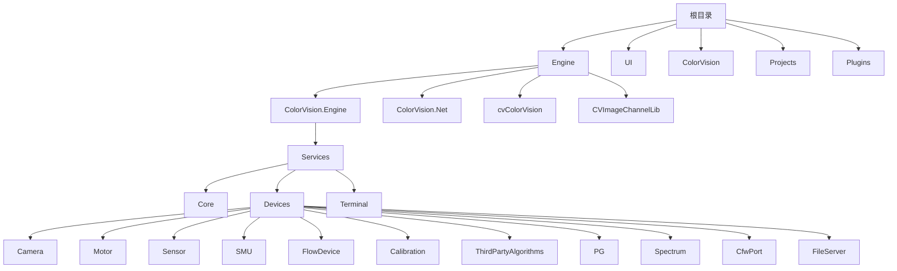
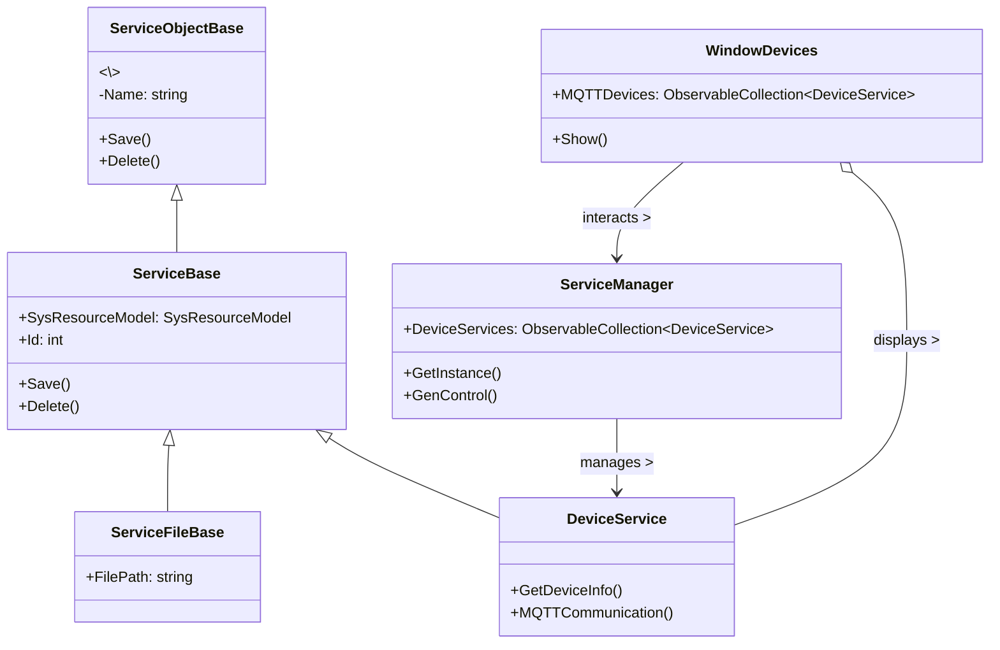

# 设备服务概览


# 设备服务概览

## 目录
1. [介绍](#介绍)
2. [项目结构](#项目结构)
3. [核心组件](#核心组件)
4. [架构概览](#架构概览)
5. [设备服务详细分析](#设备服务详细分析)
6. [依赖关系分析](#依赖关系分析)
7. [性能考虑](#性能考虑)
8. [故障排查指南](#故障排查指南)
9. [总结](#总结)
10. [附录](#附录)

## 介绍
本文档旨在概述 ColorVision 中设备服务的概念，特别关注它们如何通过 MQTT 协议与物理设备或模拟器交互，以及它们在 ServiceManager 中的角色。设备服务作为系统与硬件设备交互的桥梁，承担着设备管理、状态监控和数据传输的重要职责。本文将详细介绍设备服务的结构、实现方式及其在整体系统中的作用，帮助读者理解设备服务的设计理念及其具体实现。

---

## 项目结构

项目采用模块化设计，代码组织清晰，主要按功能和技术层次划分目录，便于维护和扩展。以下为主要目录及其说明：



1. **Engine/ColorVision.Engine/Services**  
   这是设备服务的核心目录，包含设备服务的基础类（Core）、具体设备实现（Devices）及终端服务（Terminal）等子模块。设备服务按设备类型细分子目录，如 Camera（摄像头）、Motor（电机）、Sensor（传感器）等，每个子目录包含设备的配置、显示、编辑和 MQTT 通信相关代码。

2. **Engine/ColorVision.Engine/Services/Core**  
   该目录包含设备服务的基类和公共功能，如 `ServiceBase` 和 `ServiceFileBase`，为具体设备服务提供统一的接口和基础实现。

3. **Engine/ColorVision.Engine/Services/Devices**  
   这里是各种设备服务的具体实现，包括设备的配置、界面显示和 MQTT 通信逻辑，支持通过 MQTT 与物理设备或模拟器交互。

4. **Engine/ColorVision.Engine/Services/Terminal**  
   终端服务相关代码，可能涉及设备的终端控制和管理。

5. **UI 和 ColorVision 目录**  
   负责用户界面和整体应用的启动、配置等，与设备服务形成交互。

6. **Projects 和 Plugins**  
   包含具体项目实现和插件扩展，支持设备服务的扩展和定制。

整体架构采用面向对象设计，分层清晰，设备服务通过继承和接口实现统一管理，利用 MQTT 进行设备通信，支持动态设备管理和配置。

---

## 核心组件

### 1. ServiceBase（基础服务类）
- 作为所有设备服务的基类，封装了设备服务的基本属性和方法。
- 维护设备的系统资源模型（SysResourceModel），支持保存和删除操作。
- 通过继承实现具体设备服务的扩展。

### 2. ServiceFileBase（文件服务基类）
- 继承自 ServiceBase，增加了文件路径属性，适用于需要文件操作的设备服务。

### 3. DeviceService（设备服务，示例）
- 具体设备服务类，继承自 ServiceBase，包含设备特定的功能和属性。
- 支持通过 MQTT 协议与物理设备交互。

### 4. ServiceManager（服务管理器）
- 负责管理所有设备服务的生命周期和状态。
- 提供设备服务的获取、更新和控制接口。

### 5. WindowDevices（设备管理窗口）
- WPF 窗口，作为设备服务的用户界面，展示设备列表和设备详细信息。
- 支持设备的选择、配置和控制。
- 通过绑定 ObservableCollection\<DeviceService\> 实现设备列表动态更新。

---

## 架构概览

设备服务架构核心是基于服务基类的继承体系，通过 ServiceManager 统一管理设备服务实例。设备服务通过 MQTT 协议与物理设备或模拟器通信，实现数据的发送和接收。用户界面通过 WindowDevices 等窗口展示设备状态和配置界面。



- **ServiceObjectBase** 是所有服务对象的抽象基类，定义了保存和删除的基础接口。
- **ServiceBase** 继承自 ServiceObjectBase，绑定系统资源模型，提供基础服务功能。
- **ServiceFileBase** 继承 ServiceBase，增加文件路径支持。
- **DeviceService** 继承 ServiceBase，代表具体设备服务，支持设备信息展示和 MQTT 通信。
- **ServiceManager** 单例管理所有设备服务。
- **WindowDevices** 作为用户界面窗口，展示设备列表并与 ServiceManager 交互。

---

## 设备服务详细分析

### 1. WindowDevices.xaml.cs

该文件实现了设备管理窗口的交互逻辑，主要功能包括：

- 初始化设备列表绑定到 TreeView 控件。
- 监听设备选择事件，动态展示设备详细信息或终端服务控件。
- 提供按钮事件处理，如确认保存设备配置、打开设备设置窗口。
- 通过 `ServiceManager.GetInstance()` 获取设备服务集合，支持动态刷新列表。

主要类和方法：

```csharp
public partial class WindowDevices : Window
{
    public ObservableCollection\<DeviceService\> MQTTDevices { get; set; }

    public WindowDevices()
    {
        InitializeComponent();
        this.ApplyCaption();
    }

    private void Window_Initialized(object sender, EventArgs e)
    {
        MQTTDevices = ServiceManager.GetInstance().LastGenControl ?? ServiceManager.GetInstance().DeviceServices;
        TreeView1.ItemsSource = MQTTDevices;
        Grid1.DataContext = UserConfig.Instance;
        ButtonOK.Focus();
        ServicesHelper.SelectAndFocusFirstNode(TreeView1);
    }

    private void TreeView1_SelectedItemChanged(object sender, RoutedPropertyChangedEventArgs\<object\> e)
    {
        StackPanelShow.Children.Clear();
        if (TreeView1.SelectedItem is DeviceService baseObject)
            StackPanelShow.Children.Add(baseObject.GetDeviceInfo());

        if (TreeView1.SelectedItem is TerminalServiceBase baseService)
            StackPanelShow.Children.Add(baseService.GenDeviceControl());
    }

    private void Button_Click(object sender, RoutedEventArgs e)
    {
        ServiceManager.GetInstance().GenControl(MQTTDevices);
        Close();
    }

    private void Button_Click_1(object sender, RoutedEventArgs e)
    {
        WindowDevicesSetting Service = new(MQTTDevices) { Owner = this, WindowStartupLocation = WindowStartupLocation.CenterOwner };
        Service.Closed += async (s, e) =>
        {
            if (Service.MQTTDevices1.Count > 0)
            {
                MQTTDevices = Service.MQTTDevices1;
                TreeView1.ItemsSource = MQTTDevices;
            }
            await Task.Delay(10);
            TreeViewItem firstNode = TreeView1.ItemContainerGenerator.ContainerFromIndex(0) as TreeViewItem;
            if (firstNode != null)
            {
                firstNode.IsSelected = true;
                firstNode.Focus();
            }
        };
        Service.ShowDialog();
    }
}
```

- **MQTTDevices** 属性绑定了设备服务集合，支持界面动态展示。
- `TreeView1_SelectedItemChanged` 根据选中设备类型动态加载显示控件。
- 通过按钮事件，触发设备服务管理器生成控制逻辑，或打开设备设置窗口。
- 使用异步等待确保界面刷新后选中第一个设备节点，提升用户体验。

### 2. ServiceBase.cs

该文件定义了设备服务的基础类，封装了设备的系统资源模型及基础操作。

```csharp
public class ServiceBase : ServiceObjectBase
{
    public SysResourceModel SysResourceModel { get; set; }
    public int Id { get => SysResourceModel.Id; set { } }

    public ServiceBase(SysResourceModel sysResourceModel)
    {
        SysResourceModel = sysResourceModel;
        Name = sysResourceModel.Name ?? string.Empty;
    }

    public override void Save()
    {
        SysResourceModel.Name = Name;
        VSysResourceDao.Instance.Save(SysResourceModel);
    }

    public override void Delete()
    {
        base.Delete();
        SysResourceDao.Instance.DeleteById(SysResourceModel.Id);
    }
}

public class ServiceFileBase : ServiceBase
{
    public ServiceFileBase(SysResourceModel sysResourceModel) : base(sysResourceModel)
    {
        FilePath = sysResourceModel.Value;
    }
    public string? FilePath { get; set; }
}
```

- **ServiceBase** 绑定了数据库模型 `SysResourceModel`，实现了保存和删除操作，确保设备服务状态与数据库同步。
- **ServiceFileBase** 继承自 ServiceBase，增加文件路径属性，适用于需要文件操作的设备服务。
- 通过 DAO（数据访问对象）模式实现数据库操作，保证数据持久化。

---

## 依赖关系分析

- 设备服务依赖于数据库模型（SysResourceModel）及 DAO 层，实现数据持久化。
- ServiceManager 作为单例，管理所有设备服务生命周期，提供统一访问接口。
- 设备服务通过继承 ServiceBase，保证统一接口和操作规范。
- WindowDevices 作为 UI 层，依赖 ServiceManager 获取设备服务数据，动态展示和操作设备。
- MQTT 通信相关代码分布在设备服务子模块中，负责设备与物理设备或模拟器的消息交互。

---

## 性能考虑

- 设备服务集合使用 `ObservableCollection`，支持界面动态更新，避免全量刷新带来的性能开销。
- 异步操作（如设备设置窗口关闭后刷新界面）避免界面阻塞，提升用户体验。
- 设备服务对数据库操作采用 DAO 模式，便于优化数据库访问和缓存策略。
- MQTT 通信实现应考虑消息队列管理和连接稳定性，确保设备实时响应。

---

## 故障排查指南

- **设备未显示或列表为空**  
  检查 `ServiceManager` 中设备服务集合是否正确加载，确认数据库连接正常。

- **设备信息无法显示**  
  确认设备服务对象正确实现 `GetDeviceInfo()` 方法，UI 绑定是否正常。

- **设备配置保存失败**  
  查看 `ServiceBase.Save()` 是否成功调用 DAO 层保存，检查数据库写权限。

- **MQTT 通信异常**  
  检查设备服务 MQTT 相关实现，确认 MQTT 服务器地址和连接状态。

---

## 总结

ColorVision 设备服务体系通过统一的服务基类和服务管理器实现设备的集中管理，采用 MQTT 协议实现与物理设备或模拟器的交互。设备服务按功能模块细分，支持丰富的设备类型扩展。UI 层通过 WindowDevices 等窗口动态展示设备信息和配置界面，用户操作设备配置时通过服务管理器同步更新。整体架构清晰，扩展性和维护性良好，适合多设备、多协议的工业视觉应用场景。

---

## 附录

### 参考代码文件

- [Engine/ColorVision.Engine/Services/WindowDevices.xaml.cs](https://github.com/xincheng213618/scgd_general_wpf/blob/master/Engine/ColorVision.Engine/Services/WindowDevices.xaml.cs)
- [Engine/ColorVision.Engine/Services/Core/ServiceBase.cs](https://github.com/xincheng213618/scgd_general_wpf/blob/master/Engine/ColorVision.Engine/Services/Core/ServiceBase.cs)

