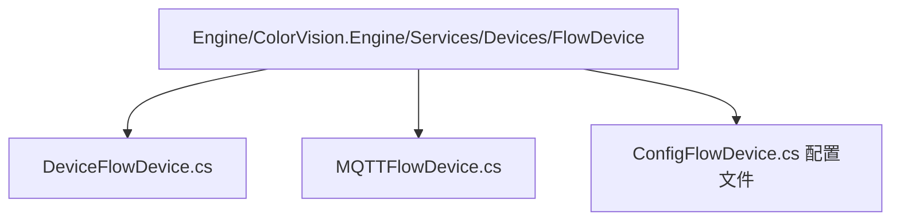
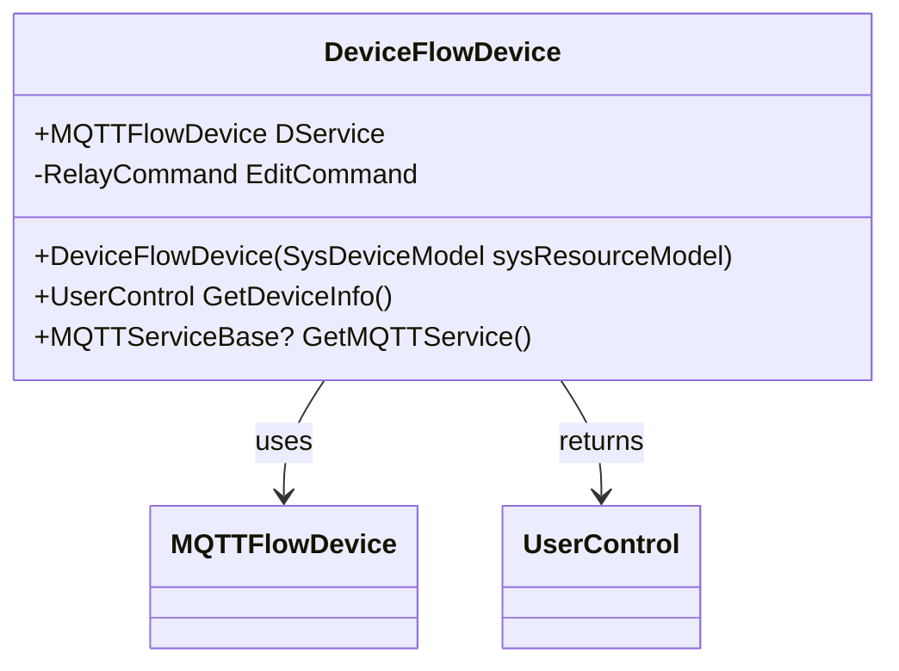
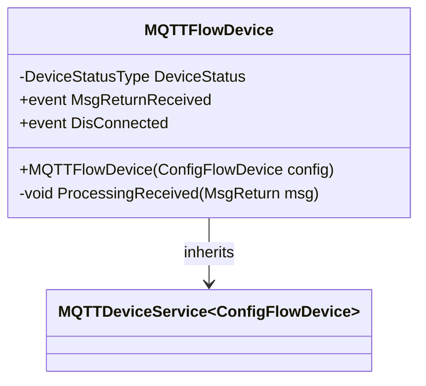

# 流程设备服务


# 流程设备服务

## 目录
1. [介绍](#介绍)
2. [项目结构](#项目结构)
3. [核心组件](#核心组件)
4. [架构概述](#架构概述)
5. [详细组件分析](#详细组件分析)
6. [依赖关系分析](#依赖关系分析)
7. [性能考虑](#性能考虑)
8. [故障排除指南](#故障排除指南)
9. [总结](#总结)
10. [附录](#附录)

## 介绍
流程设备服务是一个用于控制复杂设备序列或工业流程的服务模块。它集成了设备配置管理、设备状态监控及与流程引擎的交互，支持通过MQTT协议与设备进行通信，实现对设备的远程管理和控制。本文档旨在详细介绍其代码结构、核心功能、设计架构及关键组件，帮助用户理解和使用该服务。

---

## 项目结构
项目整体采用模块化设计，代码按功能和设备类型划分目录，便于维护和扩展。针对流程设备服务，相关代码主要集中在以下目录：



- **Engine/ColorVision.Engine/Services/Devices/FlowDevice**  
  该目录专注于流程设备服务相关实现，包含设备抽象、设备配置、通信服务（MQTT）等核心代码。
- **DeviceFlowDevice.cs**  
  设备服务的核心类，继承自通用设备服务基类，负责设备实例管理及UI交互。
- **MQTTFlowDevice.cs**  
  继承MQTT设备服务基类，实现基于MQTT协议的消息收发和设备状态管理。
- **ConfigFlowDevice.cs**（未提供，但推测存在）  
  存储流程设备的配置信息，如设备编码、连接参数等。

项目结构清晰，采用面向对象设计，职责分明，便于扩展不同类型设备的支持。

---

## 核心组件

### 1. DeviceFlowDevice 类
- 继承自泛型设备服务基类 `DeviceService\\<ConfigFlowDevice\>`。
- 管理与流程设备相关的服务实例 `MQTTFlowDevice`。
- 提供编辑设备配置的命令和界面支持。
- 重写方法返回设备信息界面和MQTT服务实例。

示例代码片段：

```csharp
public class DeviceFlowDevice : DeviceService\\<ConfigFlowDevice\>
{
    public MQTTFlowDevice DService { get; set; }

    public DeviceFlowDevice(SysDeviceModel sysResourceModel) : base(sysResourceModel)
    {
        DService = new MQTTFlowDevice(Config);
        EditCommand = new RelayCommand(a =>
        {
            EditFlowDevice window = new(this);
            window.Owner = Application.Current.GetActiveWindow();
            window.WindowStartupLocation = WindowStartupLocation.CenterOwner;
            window.ShowDialog();
        }, a => AccessControl.Check(PermissionMode.Administrator));
    }

    public override UserControl GetDeviceInfo() => new InfoFlowDevice(this);

    public override MQTTServiceBase? GetMQTTService()
    {
        return DService;
    }
}
```

- **功能说明**  
  该类是流程设备服务的入口，负责设备实例的创建和管理，提供用户界面交互入口（编辑窗口和设备信息展示），并通过MQTT服务实现设备通信。

### 2. MQTTFlowDevice 类
- 继承自 `MQTTDeviceService\\<ConfigFlowDevice\>`，实现MQTT协议的设备通信。
- 监听消息返回事件，处理设备消息。
- 管理设备状态，断开连接时将状态设置为关闭。

示例代码片段：

```csharp
public class MQTTFlowDevice : MQTTDeviceService\\<ConfigFlowDevice\>
{
    public MQTTFlowDevice(ConfigFlowDevice config) : base(config)
    {
        MsgReturnReceived += ProcessingReceived;
        DeviceStatus = DeviceStatusType.Closed;
        DisConnected += (s, e) =>
        {
            DeviceStatus = DeviceStatusType.Closed;
        };
    }

    private void ProcessingReceived(MsgReturn msg)
    {
        if (msg.DeviceCode != Config.Code) return;
        // 处理收到的消息逻辑
    }
}
```

- **功能说明**  
  该类负责通过MQTT协议与流程设备进行通信，接收和处理设备返回的消息，维护设备连接状态，确保设备状态同步。

---

## 架构概述
流程设备服务采用典型的面向对象架构，分为设备服务层和通信协议层：

- **设备服务层**  
  由 `DeviceFlowDevice` 代表，负责设备实例管理、配置编辑、UI交互。继承自通用设备服务基类，复用通用功能。

- **通信协议层**  
  由 `MQTTFlowDevice` 负责，基于MQTT协议实现消息收发和设备状态管理。通过事件机制处理异步消息。

整体架构支持设备服务的扩展和多协议通信，具备良好的模块化和分离关注点设计。

---

## 详细组件分析

### DeviceFlowDevice.cs

- **类职责**  
  作为流程设备的服务类，封装设备配置和MQTT通信服务实例，提供编辑命令和设备信息界面。

- **关键成员**  
  1. `DService`：MQTT通信服务实例，负责与设备的消息交互。  
  2. 构造函数：初始化MQTT服务，绑定编辑命令。  
  3. `EditCommand`：打开设备配置编辑窗口，权限校验为管理员。  
  4. `GetDeviceInfo()`：返回设备信息显示控件。  
  5. `GetMQTTService()`：返回MQTT服务实例。

- **设计模式**  
  - 命令模式：通过 `RelayCommand` 实现编辑命令。  
  - 依赖注入：构造函数注入设备模型。  
  - MVVM架构支持：通过命令和视图分离UI逻辑。



### MQTTFlowDevice.cs

- **类职责**  
  实现基于MQTT协议的设备通信，监听消息返回事件，维护设备连接状态。

- **关键成员**  
  1. 构造函数：订阅消息事件，初始化设备状态。  
  2. `ProcessingReceived(MsgReturn msg)`：处理接收到的消息，过滤设备代码。  
  3. 事件 `DisConnected`：断开时设置设备状态为关闭。

- **设计模式**  
  - 事件订阅模式：通过事件处理异步消息。  
  - 状态管理：维护设备连接状态。



---

## 依赖关系分析

- `DeviceFlowDevice` 依赖于 `MQTTFlowDevice` 进行设备通信。
- `MQTTFlowDevice` 继承自通用 `MQTTDeviceService`，依赖配置类 `ConfigFlowDevice`。
- 命令和权限控制依赖 `RelayCommand` 和 `AccessControl` 进行操作授权。
- UI交互依赖WPF控件 `UserControl` 和窗口类 `EditFlowDevice`。

---

## 性能考虑

- MQTT通信基于事件驱动，支持异步消息处理，减少阻塞。
- 设备状态管理简洁，避免频繁状态切换。
- 编辑窗口通过权限校验减少无效操作，提升安全性。
- 代码复用通用设备服务基类和MQTT服务基类，减少重复实现。

---

## 故障排除指南

1. **设备连接失败**  
   - 检查MQTT服务配置是否正确。  
   - 确认设备编码与配置匹配。  
   - 查看设备状态是否为关闭。

2. **消息未正确处理**  
   - 确认消息事件是否正确订阅。  
   - 检查消息设备代码过滤逻辑。

3. **编辑权限不足**  
   - 确认当前用户具备管理员权限。

---

## 总结
流程设备服务模块通过面向对象设计和MQTT通信协议，实现了对复杂流程设备的管理和控制。其核心由设备服务类和MQTT通信类组成，支持设备配置编辑、状态管理和消息处理。模块结构清晰，易于扩展，适合集成到更大流程引擎系统中。

---

## 附录

### 参考源代码链接

- [DeviceFlowDevice.cs](https://github.com/xincheng213618/scgd_general_wpf/blob/master/Engine/ColorVision.Engine/Services/Devices/FlowDevice/DeviceFlowDevice.cs)
- [MQTTFlowDevice.cs](https://github.com/xincheng213618/scgd_general_wpf/blob/master/Engine/ColorVision.Engine/Services/Devices/FlowDevice/MQTTFlowDevice.cs)

