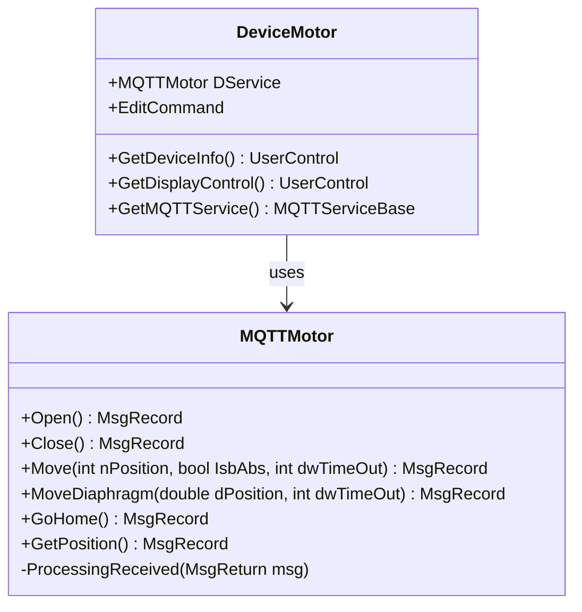

# 电机服务


# 电机服务

## 目录
1. [介绍](#介绍)
2. [项目结构](#项目结构)
3. [核心组件](#核心组件)
4. [架构概述](#架构概述)
5. [详细组件分析](#详细组件分析)
6. [依赖关系分析](#依赖关系分析)
7. [性能考虑](#性能考虑)
8. [故障排除指南](#故障排除指南)
9. [结论](#结论)

## 介绍
本项目中的电机服务模块旨在提供对电机设备的配置和控制能力，实现电机的定位、移动等操作。通过该服务，用户可以方便地管理电机状态，发送控制命令，并获取电机的实时位置反馈。该模块采用MQTT通信协议与电机硬件进行交互，确保控制的实时性和可靠性。

本文档将详细介绍电机服务的代码结构、核心组件、实现机制及其在整个系统中的作用，帮助读者全面理解电机服务的设计与使用。

## 项目结构
电机服务相关代码主要位于路径：
```
/Engine/ColorVision.Engine/Services/Devices/Motor/
```
该目录下包含以下关键文件：
- `DeviceMotor.cs`：电机设备的服务类，封装了电机设备的基本操作和界面交互。
- `MQTTMotor.cs`：基于MQTT协议的电机控制服务类，实现了具体的电机控制命令发送及状态处理。
- 其他相关UI控件如`EditMotor.xaml`、`DisplayMotor.xaml`等（未展示代码）。

项目整体采用分层架构，设备服务层(`Services/Devices`)负责具体硬件设备的管理与控制。电机服务作为设备服务的一个具体实现，继承了通用设备服务基类，利用MQTT协议实现消息通信。

## 核心组件

### 1. DeviceMotor 类
- 继承自泛型设备服务基类 `DeviceService\\<ConfigMotor\>`
- 封装了对电机设备的操作接口
- 持有 `MQTTMotor` 实例作为实际通信服务
- 提供编辑命令（弹出编辑窗口）
- 提供获取设备信息和显示控件的接口

### 2. MQTTMotor 类
- 继承自 `MQTTDeviceService\\<ConfigMotor\>`
- 实现具体的MQTT消息发送和接收处理
- 处理电机的打开、关闭、移动、获取位置等事件
- 维护设备状态（如打开、关闭）
- 通过发布消息实现对电机的控制

## 架构概述
电机服务采用面向对象设计，分为设备抽象层和通信实现层：

- **设备抽象层（DeviceMotor）**：对外暴露电机设备的操作接口和UI交互，负责调用通信层服务。
- **通信实现层（MQTTMotor）**：负责与电机硬件通过MQTT协议通信，发送控制命令，接收状态消息，更新设备状态。

这种分层设计实现了职责分离，使得设备控制逻辑与通信细节解耦，提高了系统的可维护性和扩展性。

## 详细组件分析

### 1. DeviceMotor.cs

该文件定义了 `DeviceMotor` 类，作为电机设备的服务接口。代码简洁明了，核心功能包括：

- 构造函数中初始化 `MQTTMotor` 服务实例，绑定配置参数。
- 通过 `SetIconResource` 设置设备图标，提升UI体验。
- 定义 `EditCommand`，用于弹出电机配置编辑窗口，权限控制仅限管理员。
- 重写基类方法，提供设备信息视图和显示控件。
- 提供获取MQTT服务实例接口。

代码片段示例：
```csharp
public DeviceMotor(SysDeviceModel sysResourceModel) : base(sysResourceModel)
{
    DService = new MQTTMotor(Config);
    this.SetIconResource("COMDrawingImage");
  
    EditCommand = new RelayCommand(a =>
    {
        EditMotor window = new(this);
        window.Owner = Application.Current.GetActiveWindow();
        window.WindowStartupLocation = WindowStartupLocation.CenterOwner;
        window.ShowDialog();
    }, a => AccessControl.Check(PermissionMode.Administrator));
}
```

此设计体现了典型的MVVM模式，`RelayCommand`绑定UI操作，权限控制保证安全管理。

### 2. MQTTMotor.cs

该文件定义了 `MQTTMotor` 类，负责与电机硬件的MQTT通信。主要特点：

- 构造函数中注册消息接收事件处理，初始化设备状态为关闭。
- `ProcessingReceived` 方法处理不同事件消息，更新设备状态和位置数据。
- 提供了多个控制命令方法：
  - `Open()`：发送打开电机命令
  - `Close()`：发送关闭命令
  - `Move(int nPosition, bool IsbAbs, int dwTimeOut)`：控制电机移动到指定位置
  - `MoveDiaphragm(double dPosition, int dwTimeOut)`：控制光圈移动
  - `GoHome()`：回到原点
  - `GetPosition()`：查询当前位置

代码片段示例：
```csharp
public MsgRecord Move(int nPosition, bool IsbAbs = true, int dwTimeOut = 5000)
{
    MsgSend msg = new()
    {
        EventName = "Move",
        Params = new Dictionary\\<string, object\>() {
            {"nPosition", nPosition},
            {"dwTimeOut", Config.MotorConfig.DwTimeOut},
            {"bAbs", IsbAbs}
        }
    };
    return PublishAsyncClient(msg);
}
```

消息处理逻辑根据返回码和事件名更新设备状态，保证状态同步准确。

### Mermaid 类图示例



## 依赖关系分析
- `DeviceMotor` 依赖于 `MQTTMotor` 进行具体设备控制。
- `MQTTMotor` 继承自 `MQTTDeviceService\\<ConfigMotor\>`，利用消息发布订阅机制与硬件通信。
- UI层通过 `DeviceMotor` 提供的控件接口与设备交互。
- 权限控制通过 `AccessControl.Check` 实现，保证操作安全。

## 性能考虑
- 异步消息发布保证控制命令响应及时，不阻塞UI线程。
- 设备状态通过事件驱动更新，减少轮询开销。
- 设备配置中超时时间可调，适应不同硬件响应速度。

## 故障排除指南
- 若设备状态一直为关闭，检查MQTT连接是否正常。
- 移动命令无响应，确认参数正确且设备在线。
- 编辑窗口权限不足，确认当前用户是否具备管理员权限。

## 结论
电机服务模块设计清晰，采用分层架构和MQTT通信，实现了电机的配置、控制与状态管理。通过权限控制和UI交互，用户可方便安全地操作电机设备。该模块具有良好的扩展性和维护性，适合集成到更大的设备管理系统中。

---

Source:
- [https://github.com/xincheng213618/scgd_general_wpf/blob/master/Engine/ColorVision.Engine/Services/Devices/Motor/DeviceMotor.cs](DeviceMotor.cs)
- [https://github.com/xincheng213618/scgd_general_wpf/blob/master/Engine/ColorVision.Engine/Services/Devices/Motor/MQTTMotor.cs](MQTTMotor.cs)

