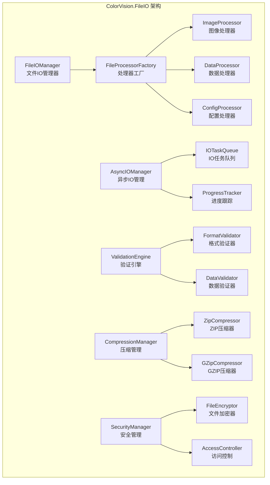

# ColorVision.FileIO

## 目录
1. [概述](#概述)
2. [核心功能](#核心功能)
3. [架构设计](#架构设计)
4. [文件格式支持](#文件格式支持)
5. [异步IO操作](#异步io操作)
6. [数据验证](#数据验证)
7. [配置管理](#配置管理)
8. [使用示例](#使用示例)
9. [API参考](#api参考)

## 概述

**ColorVision.FileIO** 是 ColorVision 系统的文件输入输出处理模块，负责各种文件格式的读取、写入和转换操作。它提供了统一的文件操作接口，支持图像文件、配置文件、数据文件等多种格式的处理。

### 基本信息

- **主要功能**: 文件读写、格式转换、数据序列化、批量处理
- **支持格式**: 图像格式(JPG,PNG,BMP,TIFF)、数据格式(JSON,XML,CSV)、配置格式(INI,YAML)
- **特色功能**: 异步IO、数据压缩、错误恢复、进度跟踪
- **架构模式**: 工厂模式、策略模式、适配器模式

## 核心功能

### 1. 图像文件处理
- **多格式支持**: JPEG、PNG、BMP、TIFF、WEBP等主流图像格式
- **元数据处理**: EXIF、XMP、IPTC等元数据读写
- **质量控制**: 压缩质量调节和无损转换
- **批量处理**: 批量格式转换和尺寸调整

### 2. 数据文件操作
- **结构化数据**: JSON、XML、CSV格式的读写
- **二进制数据**: 自定义二进制格式和协议
- **数据压缩**: ZIP、GZIP压缩和解压缩
- **数据加密**: 文件加密和解密功能

### 3. 配置文件管理
- **配置格式**: INI、YAML、JSON配置文件
- **配置解析**: 自动类型转换和验证
- **配置合并**: 多配置文件合并和继承
- **动态更新**: 配置文件监控和热更新

### 4. 文件系统操作
- **目录管理**: 目录创建、遍历、监控
- **文件操作**: 复制、移动、删除、重命名
- **权限控制**: 文件权限检查和设置
- **路径处理**: 跨平台路径处理和规范化

## 架构设计



## 文件格式支持

### 图像格式处理器

```csharp
public class ImageFileProcessor : IFileProcessor
{
    public string[] SupportedExtensions => new[] { ".jpg", ".jpeg", ".png", ".bmp", ".tiff", ".webp" };
    
    public async Task\<FileData\> ReadAsync(string filePath)
    {
        var imageData = new ImageFileData
        {
            FilePath = filePath,
            Image = await LoadImageAsync(filePath),
            Metadata = await ExtractMetadataAsync(filePath)
        };
        
        return imageData;
    }
    
    public async Task WriteAsync(string filePath, FileData data, FileWriteOptions options = null)
    {
        if (data is ImageFileData imageData)
        {
            await SaveImageAsync(filePath, imageData.Image, options?.Quality ?? 95);
            
            if (imageData.Metadata != null)
            {
                await WriteMetadataAsync(filePath, imageData.Metadata);
            }
        }
    }
    
    private async Task\<Mat\> LoadImageAsync(string filePath)
    {
        return await Task.Run(() => 
        {
            var image = Cv2.ImRead(filePath, ImreadModes.Color);
            if (image.Empty())
                throw new FileIOException($"无法加载图像: {filePath}");
            return image;
        });
    }
    
    private async Task<Dictionary\\<string, object>\> ExtractMetadataAsync(string filePath)
    {
        return await Task.Run(() =>
        {
            // 使用ExifLib或类似库提取EXIF数据
            var metadata = new Dictionary\\<string, object\>();
            
            using (var fileStream = new FileStream(filePath, FileMode.Open, FileAccess.Read))
            {
                // 提取EXIF、XMP等元数据
                ExtractExifData(fileStream, metadata);
                ExtractXmpData(fileStream, metadata);
            }
            
            return metadata;
        });
    }
}
```

### JSON数据处理器

```csharp
public class JsonFileProcessor : IFileProcessor
{
    public string[] SupportedExtensions => new[] { ".json" };
    
    private readonly JsonSerializerOptions _options = new()
    {
        WriteIndented = true,
        PropertyNamingPolicy = JsonNamingPolicy.CamelCase,
        Converters = { new JsonStringEnumConverter() }
    };
    
    public async Task\<FileData\> ReadAsync(string filePath)
    {
        var json = await File.ReadAllTextAsync(filePath, Encoding.UTF8);
        
        var data = new JsonFileData
        {
            FilePath = filePath,
            RawJson = json,
            Data = JsonSerializer.Deserialize<Dictionary\\<string, object>\>(json, _options)
        };
        
        return data;
    }
    
    public async Task WriteAsync(string filePath, FileData data, FileWriteOptions options = null)
    {
        if (data is JsonFileData jsonData)
        {
            var json = JsonSerializer.Serialize(jsonData.Data, _options);
            await File.WriteAllTextAsync(filePath, json, Encoding.UTF8);
        }
    }
    
    public async Task\<T\> ReadAsAsync\<T\>(string filePath)
    {
        var json = await File.ReadAllTextAsync(filePath, Encoding.UTF8);
        return JsonSerializer.Deserialize\<T\>(json, _options);
    }
    
    public async Task WriteAsAsync\<T\>(string filePath, T data)
    {
        var json = JsonSerializer.Serialize(data, _options);
        await File.WriteAllTextAsync(filePath, json, Encoding.UTF8);
    }
}
```

### 配置文件处理器

```csharp
public class ConfigFileProcessor : IFileProcessor
{
    public string[] SupportedExtensions => new[] { ".ini", ".cfg", ".conf", ".yaml", ".yml" };
    
    public async Task\<FileData\> ReadAsync(string filePath)
    {
        var extension = Path.GetExtension(filePath).ToLower();
        
        return extension switch
        {
            ".ini" or ".cfg" or ".conf" => await ReadIniConfigAsync(filePath),
            ".yaml" or ".yml" => await ReadYamlConfigAsync(filePath),
            _ => throw new NotSupportedException($"不支持的配置文件格式: {extension}")
        };
    }
    
    private async Task\<ConfigFileData\> ReadIniConfigAsync(string filePath)
    {
        var lines = await File.ReadAllLinesAsync(filePath, Encoding.UTF8);
        var config = new Dictionary\<string, Dictionary\\<string, string>\>();
        
        string currentSection = "General";
        config[currentSection] = new Dictionary\\<string, string\>();
        
        foreach (var line in lines)
        {
            var trimmedLine = line.Trim();
            
            if (string.IsNullOrEmpty(trimmedLine) || trimmedLine.StartsWith(";") || trimmedLine.StartsWith("#"))
                continue;
                
            if (trimmedLine.StartsWith("[") && trimmedLine.EndsWith("]"))
            {
                currentSection = trimmedLine[1..^1];
                config[currentSection] = new Dictionary\\<string, string\>();
            }
            else if (trimmedLine.Contains('='))
            {
                var parts = trimmedLine.Split('=', 2);
                var key = parts[0].Trim();
                var value = parts[1].Trim();
                config[currentSection][key] = value;
            }
        }
        
        return new ConfigFileData
        {
            FilePath = filePath,
            ConfigData = config
        };
    }
    
    private async Task\<ConfigFileData\> ReadYamlConfigAsync(string filePath)
    {
        var yaml = await File.ReadAllTextAsync(filePath, Encoding.UTF8);
        
        // 使用YamlDotNet库解析YAML
        var deserializer = new YamlDotNet.Serialization.Deserializer();
        var data = deserializer.Deserialize<Dictionary\\<string, object>\>(yaml);
        
        return new ConfigFileData
        {
            FilePath = filePath,
            ConfigData = ConvertToStringDict(data)
        };
    }
}
```

## 异步IO操作

### 异步IO管理器

```csharp
public class AsyncIOManager
{
    private readonly SemaphoreSlim _semaphore;
    private readonly ConcurrentQueue\<IOTask\> _taskQueue;
    private readonly CancellationTokenSource _cancellationTokenSource;
    
    public AsyncIOManager(int maxConcurrentTasks = 4)
    {
        _semaphore = new SemaphoreSlim(maxConcurrentTasks, maxConcurrentTasks);
        _taskQueue = new ConcurrentQueue\<IOTask\>();
        _cancellationTokenSource = new CancellationTokenSource();
    }
    
    public async Task\<T\> ExecuteAsync\<T\>(Func<Task\<T\>> operation, IProgress\<ProgressInfo\> progress = null)
    {
        await _semaphore.WaitAsync(_cancellationTokenSource.Token);
        
        try
        {
            var task = new IOTask\<T\>
            {
                Operation = operation,
                Progress = progress,
                CancellationToken = _cancellationTokenSource.Token
            };
            
            return await ExecuteTaskAsync(task);
        }
        finally
        {
            _semaphore.Release();
        }
    }
    
    private async Task\<T\> ExecuteTaskAsync\<T\>(IOTask\<T\> task)
    {
        var stopwatch = Stopwatch.StartNew();
        
        try
        {
            task.Progress?.Report(new ProgressInfo { Status = "开始执行", Percentage = 0 });
            
            var result = await task.Operation();
            
            task.Progress?.Report(new ProgressInfo { Status = "执行完成", Percentage = 100 });
            
            return result;
        }
        catch (Exception ex)
        {
            task.Progress?.Report(new ProgressInfo { Status = $"执行失败: {ex.Message}", Percentage = -1 });
            throw;
        }
        finally
        {
            stopwatch.Stop();
            LogExecutionTime(stopwatch.Elapsed);
        }
    }
    
    public async Task<List\<T\>> ExecuteBatchAsync\<T\>(
        IEnumerable<Func<Task\<T\>>> operations, 
        IProgress\<BatchProgressInfo\> progress = null)
    {
        var operationList = operations.ToList();
        var results = new List\<T\>(operationList.Count);
        var completed = 0;
        
        var tasks = operationList.Select(async (operation, index) =>
        {
            var result = await ExecuteAsync(operation);
            
            Interlocked.Increment(ref completed);
            progress?.Report(new BatchProgressInfo
            {
                Completed = completed,
                Total = operationList.Count,
                Percentage = (completed * 100) / operationList.Count
            });
            
            return result;
        });
        
        return (await Task.WhenAll(tasks)).ToList();
    }
}
```

### 进度跟踪

```csharp
public class ProgressInfo
{
    public string Status { get; set; }
    public int Percentage { get; set; }
    public long BytesProcessed { get; set; }
    public long TotalBytes { get; set; }
    public TimeSpan ElapsedTime { get; set; }
    public TimeSpan EstimatedRemainingTime { get; set; }
}

public class BatchProgressInfo
{
    public int Completed { get; set; }
    public int Total { get; set; }
    public int Percentage { get; set; }
    public List\\<string\> FailedItems { get; set; } = new();
    public Dictionary\\<string, object\> AdditionalInfo { get; set; } = new();
}

public class FileProgressTracker : IProgress\<ProgressInfo\>
{
    public event EventHandler\<ProgressInfo\> ProgressChanged;
    
    public void Report(ProgressInfo value)
    {
        ProgressChanged?.Invoke(this, value);
    }
}
```

## 数据验证

### 文件格式验证器

```csharp
public class FileFormatValidator
{
    private readonly Dictionary\\<string, IFormatValidator\> _validators;
    
    public FileFormatValidator()
    {
        _validators = new Dictionary\\<string, IFormatValidator\>
        {
            [".jpg"] = new JpegValidator(),
            [".png"] = new PngValidator(),
            [".json"] = new JsonValidator(),
            [".xml"] = new XmlValidator(),
            [".yaml"] = new YamlValidator()
        };
    }
    
    public async Task\<ValidationResult\> ValidateAsync(string filePath)
    {
        var extension = Path.GetExtension(filePath).ToLower();
        
        if (!_validators.TryGetValue(extension, out var validator))
        {
            return new ValidationResult
            {
                IsValid = false,
                ErrorMessage = $"不支持的文件格式: {extension}"
            };
        }
        
        return await validator.ValidateAsync(filePath);
    }
}

public class JsonValidator : IFormatValidator
{
    public async Task\<ValidationResult\> ValidateAsync(string filePath)
    {
        try
        {
            var json = await File.ReadAllTextAsync(filePath);
            
            // 尝试解析JSON
            JsonDocument.Parse(json);
            
            return new ValidationResult { IsValid = true };
        }
        catch (JsonException ex)
        {
            return new ValidationResult
            {
                IsValid = false,
                ErrorMessage = $"JSON格式错误: {ex.Message}",
                Line = ex.LineNumber,
                Position = ex.BytePositionInLine
            };
        }
        catch (Exception ex)
        {
            return new ValidationResult
            {
                IsValid = false,
                ErrorMessage = $"文件读取错误: {ex.Message}"
            };
        }
    }
}

public class ImageValidator : IFormatValidator
{
    public async Task\<ValidationResult\> ValidateAsync(string filePath)
    {
        return await Task.Run(() =>
        {
            try
            {
                using var image = Cv2.ImRead(filePath, ImreadModes.Unchanged);
                
                if (image.Empty())
                {
                    return new ValidationResult
                    {
                        IsValid = false,
                        ErrorMessage = "无法识别的图像格式或文件损坏"
                    };
                }
                
                // 检查图像基本属性
                var info = new Dictionary\\<string, object\>
                {
                    ["Width"] = image.Width,
                    ["Height"] = image.Height,
                    ["Channels"] = image.Channels(),
                    ["Depth"] = image.Depth(),
                    ["Type"] = image.Type()
                };
                
                return new ValidationResult
                {
                    IsValid = true,
                    AdditionalInfo = info
                };
            }
            catch (Exception ex)
            {
                return new ValidationResult
                {
                    IsValid = false,
                    ErrorMessage = $"图像验证失败: {ex.Message}"
                };
            }
        });
    }
}
```

## 配置管理

### 配置管理器

```csharp
public class ConfigManager
{
    private readonly Dictionary\\<string, object\> _config;
    private readonly FileSystemWatcher _fileWatcher;
    private readonly string _configFilePath;
    
    public event EventHandler\<ConfigChangedEventArgs\> ConfigChanged;
    
    public ConfigManager(string configFilePath)
    {
        _configFilePath = configFilePath;
        _config = new Dictionary\\<string, object\>();
        
        LoadConfig();
        SetupFileWatcher();
    }
    
    public T GetValue\<T\>(string key, T defaultValue = default)
    {
        if (_config.TryGetValue(key, out var value))
        {
            return (T)Convert.ChangeType(value, typeof(T));
        }
        
        return defaultValue;
    }
    
    public void SetValue\<T\>(string key, T value)
    {
        _config[key] = value;
        SaveConfig();
    }
    
    public async Task LoadConfigAsync()
    {
        var processor = FileProcessorFactory.Create(_configFilePath);
        var data = await processor.ReadAsync(_configFilePath);
        
        if (data is ConfigFileData configData)
        {
            _config.Clear();
            
            foreach (var section in configData.ConfigData)
            {
                foreach (var kvp in section.Value)
                {
                    var key = string.IsNullOrEmpty(section.Key) ? kvp.Key : $"{section.Key}.{kvp.Key}";
                    _config[key] = kvp.Value;
                }
            }
        }
    }
    
    public async Task SaveConfigAsync()
    {
        var configData = new ConfigFileData
        {
            FilePath = _configFilePath,
            ConfigData = ConvertToSectionDict(_config)
        };
        
        var processor = FileProcessorFactory.Create(_configFilePath);
        await processor.WriteAsync(_configFilePath, configData);
    }
    
    private void SetupFileWatcher()
    {
        var directory = Path.GetDirectoryName(_configFilePath);
        var fileName = Path.GetFileName(_configFilePath);
        
        _fileWatcher = new FileSystemWatcher(directory, fileName)
        {
            NotifyFilter = NotifyFilters.LastWrite | NotifyFilters.Size,
            EnableRaisingEvents = true
        };
        
        _fileWatcher.Changed += async (sender, args) =>
        {
            try
            {
                // 延迟一点时间，确保文件写入完成
                await Task.Delay(100);
                await LoadConfigAsync();
                
                ConfigChanged?.Invoke(this, new ConfigChangedEventArgs
                {
                    FilePath = args.FullPath,
                    ChangeType = args.ChangeType
                });
            }
            catch (Exception ex)
            {
                // 记录错误但不抛出异常
                Console.WriteLine($"配置文件重新加载失败: {ex.Message}");
            }
        };
    }
}
```

## 使用示例

### 基础文件操作

```csharp
public class FileIOExample
{
    private readonly FileIOManager _fileIOManager;
    
    public FileIOExample()
    {
        _fileIOManager = new FileIOManager();
    }
    
    // 图像文件处理示例
    public async Task ProcessImagesAsync(string[] imagePaths, string outputDir)
    {
        var progress = new Progress\<BatchProgressInfo\>(info =>
        {
            Console.WriteLine($"处理进度: {info.Percentage}% ({info.Completed}/{info.Total})");
        });
        
        var operations = imagePaths.Select\<string, Func<Task<string>>\>(imagePath => async () =>
        {
            // 读取图像
            var imageData = await _fileIOManager.ReadAsync\<ImageFileData\>(imagePath);
            
            // 处理图像 (例如调整大小)
            var resizedImage = imageData.Image.Resize(new Size(800, 600));
            imageData.Image = resizedImage;
            
            // 保存处理后的图像
            var outputPath = Path.Combine(outputDir, $"processed_{Path.GetFileName(imagePath)}");
            await _fileIOManager.WriteAsync(outputPath, imageData, new FileWriteOptions { Quality = 90 });
            
            return outputPath;
        });
        
        var results = await _fileIOManager.ExecuteBatchAsync(operations, progress);
        
        Console.WriteLine($"成功处理 {results.Count} 个图像文件");
    }
    
    // JSON配置文件操作示例
    public async Task ManageConfigAsync()
    {
        var configPath = "appsettings.json";
        
        // 创建配置对象
        var config = new AppSettings
        {
            DatabaseConnection = "Server=localhost;Database=colorvision;",
            LogLevel = "Information",
            Features = new Dictionary\\<string, bool\>
            {
                ["EnableCuda"] = true,
                ["EnableMultiThreading"] = true
            }
        };
        
        // 保存配置
        await _fileIOManager.WriteAsync(configPath, config);
        
        // 读取配置
        var loadedConfig = await _fileIOManager.ReadAsync\<AppSettings\>(configPath);
        
        Console.WriteLine($"数据库连接: {loadedConfig.DatabaseConnection}");
        Console.WriteLine($"日志级别: {loadedConfig.LogLevel}");
    }
    
    // 批量文件处理示例
    public async Task BatchProcessFilesAsync(string sourceDir, string targetDir, string pattern = "*.*")
    {
        var files = Directory.GetFiles(sourceDir, pattern, SearchOption.AllDirectories);
        
        var progress = new Progress\<BatchProgressInfo\>(info =>
        {
            Console.WriteLine($"批量处理进度: {info.Percentage}%");
            
            if (info.FailedItems.Any())
            {
                Console.WriteLine($"失败的文件: {string.Join(", ", info.FailedItems)}");
            }
        });
        
        var operations = files.Select\<string, Func<Task<string>>\>(file => async () =>
        {
            try
            {
                var relativePath = Path.GetRelativePath(sourceDir, file);
                var targetPath = Path.Combine(targetDir, relativePath);
                
                // 确保目标目录存在
                Directory.CreateDirectory(Path.GetDirectoryName(targetPath));
                
                // 验证文件
                var validation = await _fileIOManager.ValidateAsync(file);
                if (!validation.IsValid)
                {
                    throw new InvalidOperationException($"文件验证失败: {validation.ErrorMessage}");
                }
                
                // 复制文件
                await File.CopyToAsync(file, targetPath);
                
                return targetPath;
            }
            catch (Exception ex)
            {
                throw new FileIOException($"处理文件 {file} 失败: {ex.Message}", ex);
            }
        });
        
        try
        {
            var results = await _fileIOManager.ExecuteBatchAsync(operations, progress);
            Console.WriteLine($"成功处理 {results.Count} 个文件");
        }
        catch (Exception ex)
        {
            Console.WriteLine($"批量处理失败: {ex.Message}");
        }
    }
}
```

### 高级功能示例

```csharp
public class AdvancedFileIOExample
{
    // 加密文件操作
    public async Task EncryptedFileOperationsAsync()
    {
        var encryptionKey = "MySecretKey123456"; // 实际应用中应该更安全地管理密钥
        var fileIOManager = new FileIOManager();
        
        // 加密写入
        var sensitiveData = new { UserId = 123, Password = "secret", ApiKey = "abc123" };
        var encryptedOptions = new FileWriteOptions
        {
            Encryption = new EncryptionOptions
            {
                Key = encryptionKey,
                Algorithm = EncryptionAlgorithm.AES256
            }
        };
        
        await fileIOManager.WriteAsync("sensitive_data.enc", sensitiveData, encryptedOptions);
        
        // 解密读取
        var decryptedData = await fileIOManager.ReadAsync\<dynamic\>("sensitive_data.enc", new FileReadOptions
        {
            Decryption = new DecryptionOptions
            {
                Key = encryptionKey,
                Algorithm = EncryptionAlgorithm.AES256
            }
        });
        
        Console.WriteLine($"解密后的数据: {JsonSerializer.Serialize(decryptedData, new JsonSerializerOptions { WriteIndented = true })}");
    }
    
    // 压缩文件操作
    public async Task CompressedFileOperationsAsync()
    {
        var fileIOManager = new FileIOManager();
        
        // 压缩多个文件到ZIP
        var filesToCompress = new[]
        {
            "image1.jpg",
            "image2.png",
            "config.json",
            "data.csv"
        };
        
        var compressionOptions = new CompressionOptions
        {
            Algorithm = CompressionAlgorithm.ZIP,
            Level = CompressionLevel.Optimal
        };
        
        await fileIOManager.CompressFilesAsync("archive.zip", filesToCompress, compressionOptions);
        
        // 解压缩文件
        await fileIOManager.DecompressAsync("archive.zip", "extracted_files/");
        
        Console.WriteLine("文件压缩和解压缩完成");
    }
    
    // 文件监控和自动处理
    public async Task SetupFileMonitoringAsync()
    {
        var monitor = new FileSystemMonitor("input_folder");
        
        monitor.FileAdded += async (sender, args) =>
        {
            Console.WriteLine($"检测到新文件: {args.FullPath}");
            
            try
            {
                // 验证文件
                var validation = await FileValidator.ValidateAsync(args.FullPath);
                if (!validation.IsValid)
                {
                    Console.WriteLine($"文件验证失败: {validation.ErrorMessage}");
                    return;
                }
                
                // 自动处理文件
                await ProcessNewFileAsync(args.FullPath);
            }
            catch (Exception ex)
            {
                Console.WriteLine($"处理文件失败: {ex.Message}");
            }
        };
        
        monitor.Start();
        
        Console.WriteLine("文件监控已启动，按任意键停止...");
        Console.ReadKey();
        
        monitor.Stop();
    }
    
    private async Task ProcessNewFileAsync(string filePath)
    {
        var processor = FileProcessorFactory.Create(filePath);
        var data = await processor.ReadAsync(filePath);
        
        // 根据文件类型执行不同的处理逻辑
        switch (data)
        {
            case ImageFileData imageData:
                await ProcessImageAsync(imageData);
                break;
                
            case JsonFileData jsonData:
                await ProcessJsonAsync(jsonData);
                break;
                
            default:
                Console.WriteLine($"未知文件类型: {data.GetType().Name}");
                break;
        }
    }
    
    private async Task ProcessImageAsync(ImageFileData imageData)
    {
        // 图像处理逻辑
        Console.WriteLine($"处理图像: {imageData.FilePath}");
        
        // 生成缩略图
        var thumbnail = imageData.Image.Resize(new Size(200, 200));
        var thumbnailPath = Path.ChangeExtension(imageData.FilePath, ".thumb.jpg");
        
        await File.WriteAllBytesAsync(thumbnailPath, thumbnail.ToBytes(".jpg"));
        
        // 提取并保存元数据
        if (imageData.Metadata != null && imageData.Metadata.Any())
        {
            var metadataPath = Path.ChangeExtension(imageData.FilePath, ".metadata.json");
            var json = JsonSerializer.Serialize(imageData.Metadata, new JsonSerializerOptions { WriteIndented = true });
            await File.WriteAllTextAsync(metadataPath, json);
        }
    }
    
    private async Task ProcessJsonAsync(JsonFileData jsonData)
    {
        // JSON数据处理逻辑
        Console.WriteLine($"处理JSON: {jsonData.FilePath}");
        
        // 验证JSON结构
        var validator = new JsonSchemaValidator();
        var result = await validator.ValidateAsync(jsonData.RawJson, "expected_schema.json");
        
        if (result.IsValid)
        {
            Console.WriteLine("JSON验证通过");
        }
        else
        {
            Console.WriteLine($"JSON验证失败: {string.Join(", ", result.Errors)}");
        }
    }
}
```

## API参考

### 主要接口

```csharp
public interface IFileProcessor
{
    string[] SupportedExtensions { get; }
    Task\<FileData\> ReadAsync(string filePath);
    Task WriteAsync(string filePath, FileData data, FileWriteOptions options = null);
}

public interface IFileIOManager
{
    Task\<T\> ReadAsync\<T\>(string filePath, FileReadOptions options = null) where T : FileData;
    Task WriteAsync\<T\>(string filePath, T data, FileWriteOptions options = null) where T : FileData;
    Task\<ValidationResult\> ValidateAsync(string filePath);
    Task CompressFilesAsync(string archivePath, string[] filePaths, CompressionOptions options = null);
    Task DecompressAsync(string archivePath, string extractPath);
}

public abstract class FileData
{
    public string FilePath { get; set; }
    public DateTime LastModified { get; set; }
    public long FileSize { get; set; }
    public Dictionary\\<string, object\> Metadata { get; set; }
}

public class FileWriteOptions
{
    public int Quality { get; set; } = 95;
    public EncryptionOptions Encryption { get; set; }
    public CompressionOptions Compression { get; set; }
    public bool CreateBackup { get; set; } = false;
    public bool OverwriteExisting { get; set; } = true;
}
```

### 异常类型

```csharp
public class FileIOException : Exception
{
    public string FilePath { get; }
    public FileIOError ErrorType { get; }
    
    public FileIOException(string message, string filePath = null) 
        : base(message)
    {
        FilePath = filePath;
    }
    
    public FileIOException(string message, Exception innerException, string filePath = null) 
        : base(message, innerException)
    {
        FilePath = filePath;
    }
}

public enum FileIOError
{
    FileNotFound,
    AccessDenied,
    InvalidFormat,
    CorruptedData,
    InsufficientSpace,
    NetworkError,
    TimeoutError,
    ValidationFailed
}
```

## 相关资源

- [文件系统监控指南](../developer-guide/file-system-monitoring/)
- [数据序列化最佳实践](../developer-guide/data-serialization/)
- [文件加密和安全](../developer-guide/file-security/)
- [性能优化建议](../developer-guide/performance-optimization/)
- [API完整参考](../developer-guide/api-reference/ColorVision.FileIO/)