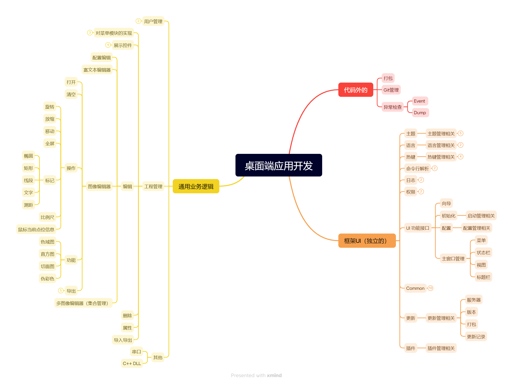

# Pattern Plugin - 图卡生成工具

---
**元数据:**
- 标题: Pattern Plugin - 图卡生成工具
- 状态: 已发布
- 更新时间: 2024-12-19
- 作者: ColorVision 开发团队
- 插件版本: 1.0
- 最低 ColorVision 版本: 1.3.12.21
---

## 简介

Pattern Plugin (图卡生成工具) 是 ColorVision 的核心测试图案生成插件，提供了11种不同类型的测试图案，用于显示器校准、相机标定、光学测量等应用场景。该插件支持自定义分辨率、参数模板管理、实时预览和批量生成等功能。


*ColorVision 主界面及插件系统概览*

## 核心功能

### 🎯 主要特性

- **多样化图案类型**: 支持11种专业测试图案
- **自定义分辨率**: 支持从VGA到8K的任意分辨率
- **模板系统**: 参数保存、加载和共享
- **实时预览**: 即时显示生成的图案
- **视场定制**: 灵活的图案定位和尺寸控制
- **批量生成**: 一次生成多个测试图案
- **多格式导出**: 支持PNG、JPEG、BMP等格式

### 📊 支持的图案类型

| 类型 | 中文名称 | 主要用途 | 关键参数 |
|------|---------|----------|---------|
| Solid | 纯色 | 颜色准确性测试、伽马校准 | 颜色值、亮度级别 |
| Stripe | 隔行点亮 | 响应时间测试、运动模糊评估 | 条纹宽度、间距、方向 |
| Ring | 环形图案 | 镜头畸变测试、对焦精度 | 环宽度、间距、中心线 |
| MTF | 调制传递函数 | 分辨率和锐度测试 | 线条厚度、长度、图表类型 |
| NineDot | 九点 | 多点对焦和对齐测试 | 点尺寸、间距、网格定位 |
| Dot | 点阵 | 像素精度和对齐测试 | 点半径、间距、行列数 |
| CrossGrid | 十字网格 | 几何精度和网格对齐 | 十字尺寸、网格间距 |
| Cross | 十字 | 中心对齐和定位参考 | 线宽、长度、多位置 |
| Checkerboard | 棋盘格 | 相机标定和畸变校正 | 网格尺寸、单元维度 |
| SFR | 空间频率响应 | 高级分辨率和频率响应测试 | 频率范围、边缘方向 |
| LinePairMTF | 线对MTF | 详细MTF分析 | 线对密度、方向角度 |

## 使用指南

### 基本操作流程

#### 1. 启动插件

```
ColorVision → 工具栏 → Plugins → Pattern
```

或通过菜单访问：
```
菜单栏 → 插件 → 图卡生成工具
```

#### 2. 选择图案类型

1. 在左侧列表中选择所需的图案类型
2. 右侧编辑器面板将显示相应的参数设置
3. 根据测试需求调整参数

#### 3. 设置分辨率

选择预设分辨率或自定义：

**预设分辨率**:
- 8K: 3840×2160
- 4K: 1920×1080  
- HD: 1280×720
- XGA: 1024×768
- SVGA: 800×600
- VGA: 640×480

**自定义分辨率**:
- 在宽度和高度字段中输入具体数值
- 支持最大分辨率：8192×8192

#### 4. 参数配置

每种图案类型都有特定的参数选项：

**通用参数**:
- 主颜色 (MainBrush): 图案主色
- 辅助颜色 (AltBrush): 图案副色  
- 视场范围 (FieldOfView): X和Y方向的覆盖比例

**特定参数示例**:

```yaml
# 棋盘格参数
GridX: 8                    # 水平网格数
GridY: 8                    # 垂直网格数
CellWidth: 32              # 单元格宽度
CellHeight: 32             # 单元格高度
SizeMode: ByGridCount      # 尺寸模式

# MTF图案参数  
ChartType: FourLinePair    # 图表类型
LineThickness: 2           # 线条厚度
LineLength: 40            # 线条长度
```

#### 5. 生成和预览

1. 点击"生成"按钮创建图案
2. 图案将在主显示区域中预览
3. 可以实时调整参数并重新生成

#### 6. 导出图案

支持多种导出选项：

```csharp
// 导出格式选项
PatternFormat.PNG    // PNG格式 (推荐)
PatternFormat.JPEG   // JPEG格式
PatternFormat.BMP    // BMP格式
```

### 模板管理

#### 保存模板

1. 配置好图案参数
2. 点击"保存模板"按钮
3. 输入模板名称
4. 模板将保存到本地配置中

#### 加载模板

1. 从模板列表中选择已保存的模板
2. 点击"加载模板"
3. 参数将自动应用到当前图案

#### 导入/导出模板组

```csharp
// 导出模板组
PatternManager.ExportTemplateGroup("MyTemplates.json");

// 导入模板组
PatternManager.ImportTemplateGroup("MyTemplates.json");
```

### 批量生成

对于测试序列，可以批量生成多个图案：

1. 创建图案配置列表
2. 设置统一的分辨率
3. 批量生成并保存

```csharp
// 批量生成示例代码
var patterns = new List\\<PatternConfig\>
{
    new SolidConfig { MainBrush = Brushes.White },
    new SolidConfig { MainBrush = Brushes.Black },
    new CheckerboardConfig { GridX = 8, GridY = 8 }
};

foreach (var config in patterns)
{
    var pattern = GeneratePattern(config, 1920, 1080);
    SavePattern(pattern, GetTemplateName(config));
}
```

## 详细图案说明

### 1. 纯色图案 (Solid)

**用途**: 基础颜色测试、白点校准、黑电平测试

**参数设置**:
```yaml
MainBrush: White/Black/Red/Green/Blue  # 主颜色
Tag: "W"/"K"/"R"/"G"/"B"              # 颜色标识
```

**应用场景**:
- 显示器白点校准
- 黑电平一致性测试
- 颜色均匀性评估
- 基础颜色准确性验证

### 2. 隔行点亮 (Stripe)

**用途**: 响应时间测试、串扰分析

**参数设置**:
```yaml
IsHorizontal: true/false        # 水平/垂直方向
HorizontalSpacing: 4           # 水平间距
HorizontalWidth: 2             # 水平线宽
VerticalSpacing: 4             # 垂直间距  
VerticalWidth: 2               # 垂直线宽
FieldOfViewX: 0.8             # X方向视场
FieldOfViewY: 0.8             # Y方向视场
```

**应用场景**:
- 像素响应时间测量
- 串扰分析
- 运动模糊评估

### 3. 环形图案 (Ring)

**用途**: 镜头畸变测试、光学系统校准

**参数设置**:
```yaml
RingWidth: 10                  # 环宽度
RingOffsets: [0, 20, 40, 60]  # 环间距配置
DrawCenterLine: true           # 绘制中心线
MainBrush: Black              # 背景色
AltBrush: White               # 环色
```

**应用场景**:
- 镜头畸变测量
- 对焦精度测试
- 光学系统校准

### 4. MTF图案 (MTF)

**用途**: 调制传递函数测试、分辨率评估

**参数设置**:
```yaml
ChartType: FourLinePair       # 四线对图
LineThickness: 2              # 线条厚度
LineLength: 40               # 线条长度
LineBrush: Black             # 线条颜色
BackgroundBrush: White       # 背景颜色
```

**图表类型**:
- `FourLinePair`: 四线对图案
- `SlantedRect`: 倾斜方块
- `BMW`: 宝马图案

**应用场景**:
- 相机分辨率测试
- 镜头性能评估
- 图像锐度分析

### 5. 九点图案 (NineDot)

**用途**: 多点对焦测试、对齐精度验证

**参数设置**:
```yaml
DotRadius: 5                  # 点半径
Spacing: 100                 # 点间距
MainBrush: Black             # 背景色
AltBrush: White              # 点颜色
```

**应用场景**:
- 多相机对齐
- 对焦均匀性测试
- 几何精度验证

### 6. 点阵图案 (Dot)

**用途**: 像素映射、显示器校准

**参数设置**:
```yaml
Spacing: 20                   # 点间距
Radius: 3                    # 点半径
Rows: -1                     # 行数（-1为自适应）
Cols: -1                     # 列数（-1为自适应）
FieldOfViewX: 1.0            # X方向视场
FieldOfViewY: 1.0            # Y方向视场
```

**应用场景**:
- 像素精度测试
- 显示器校准
- 几何精度验证

### 7. 十字网格 (CrossGrid)

**用途**: 几何校准、测量参考

**参数设置**:
```yaml
CrossSize: 10                # 十字尺寸
GridSpacing: 50             # 网格间距
LineWidth: 1                # 线宽
MainBrush: Black            # 背景色
AltBrush: White             # 十字颜色
```

**应用场景**:
- 几何校准
- 测量参考网格
- 畸变分析

### 8. 十字图案 (Cross)

**用途**: 中心对齐、位置参考

**参数设置**:
```yaml
HorizontalWidth: 1           # 水平线宽
VerticalWidth: 1            # 垂直线宽  
HorizontalLength: 10        # 水平长度
VerticalLength: 10          # 垂直长度
FieldX: [0.5]              # X位置数组
FieldY: [0.5]              # Y位置数组
```

**应用场景**:
- 光轴对齐
- 中心点参考
- 多点定位

### 9. 棋盘格 (Checkerboard)

**用途**: 相机标定、畸变校正

**参数设置**:
```yaml
SizeMode: ByGridCount        # 尺寸模式
GridX: 8                    # 水平网格数
GridY: 8                    # 垂直网格数
CellW: 32                   # 单元格宽度
CellH: 32                   # 单元格高度
FieldOfViewX: 1.0           # X方向视场
FieldOfViewY: 1.0           # Y方向视场
```

**尺寸模式**:
- `ByGridCount`: 按网格数量
- `ByCellSize`: 按单元格尺寸

**应用场景**:
- 相机内参标定
- 畸变系数计算
- 立体视觉校准

### 10. SFR图案 (SFR)

**用途**: 空间频率响应测试

**参数设置**: (根据具体实现调整)
```yaml
FrequencyRange: [0.1, 0.5]   # 频率范围
EdgeOrientation: 5           # 边缘倾斜角度
ContrastLevel: 0.8          # 对比度级别
```

**应用场景**:
- 图像质量评估
- 镜头测试
- 空间分辨率分析

### 11. 线对MTF (LinePairMTF)

**用途**: 高精度MTF分析

**参数设置**:
```yaml
LinePairDensity: 10          # 线对密度
Orientations: [0, 45, 90]   # 多方向角度
CustomSpacing: true         # 自定义间距
ChartTypes: Multiple        # 多图表类型
```

**应用场景**:
- 高精度分辨率测试
- 光学工作台测量
- 专业图像分析

## 高级功能

### 视场控制 (Field of View)

视场功能允许在显示区域内精确定位图案：

```csharp
// 中心区域80%的显示
config.FieldOfViewX = 0.8;
config.FieldOfViewY = 0.8;

// 图案将居中显示在80%的区域内
int fovWidth = (int)(totalWidth * config.FieldOfViewX);
int fovHeight = (int)(totalHeight * config.FieldOfViewY);
int startX = (totalWidth - fovWidth) / 2;
int startY = (totalHeight - fovHeight) / 2;
```

### 多位置十字

十字图案支持多个位置的配置：

```csharp
// JSON格式配置多个X和Y位置
config.FieldXJson = "[0.2, 0.5, 0.8]";  // 三个X位置
config.FieldYJson = "[0.3, 0.5, 0.7]";  // 三个Y位置

// 将生成9个十字（3×3矩阵）
```

### 自适应点阵

点阵图案支持自适应行列数：

```csharp
// 设置为-1启用自适应
config.Rows = -1;    // 根据spacing和区域高度自动计算
config.Cols = -1;    // 根据spacing和区域宽度自动计算

// 或手动指定
config.Rows = 10;    // 固定10行
config.Cols = 15;    // 固定15列
```

## 技术实现

### 核心架构

Pattern插件基于以下架构模式：

```csharp
// 插件接口定义
public interface IPattern
{
    ViewModelBase GetConfig();           // 获取配置
    void SetConfig(string config);       // 设置配置
    UserControl GetPatternEditor();      // 获取编辑器
    Mat Gen(int height, int width);      // 生成图案
    string GetTemplateName();            // 获取模板名
}

// 泛型基类
public abstract class IPatternBase\<T\> : IPatternBase 
    where T : ViewModelBase, new()
{
    public T Config { get; set; } = new T();
    // 具体实现...
}
```

### OpenCV集成

图案生成使用OpenCV进行图像处理：

```csharp
// 创建图像
Mat image = new Mat(height, width, MatType.CV_8UC3, backgroundColor);

// 绘制几何图形
Cv2.Circle(image, center, radius, color, thickness);
Cv2.Rectangle(image, rect, color, thickness);
Cv2.Line(image, pt1, pt2, color, thickness);

// 转换为显示格式
var bitmap = image.ToWriteableBitmap();
```

### 内存管理

正确的资源管理对于大分辨率图案很重要：

```csharp
// 使用using语句确保资源释放
using (var pattern = GeneratePattern(config, width, height))
{
    // 使用图案
    ProcessPattern(pattern);
} // pattern自动释放

// 手动释放
Mat pattern = GeneratePattern(config, width, height);
try
{
    ProcessPattern(pattern);
}
finally
{
    pattern?.Dispose();
}
```

## 性能优化

### 大分辨率处理

对于4K/8K等大分辨率图案，建议：

1. **分块处理**：将大图案分块生成
2. **内存监控**：监控内存使用情况
3. **渐进式渲染**：先显示低分辨率预览

```csharp
// 分块生成示例
const int blockSize = 1024;
for (int y = 0; y < height; y += blockSize)
{
    for (int x = 0; x < width; x += blockSize)
    {
        var blockRect = new Rect(x, y, 
            Math.Min(blockSize, width - x),
            Math.Min(blockSize, height - y));
        
        GenerateBlock(pattern, blockRect, config);
    }
}
```

### 实时预览优化

实时预览时使用缩小的分辨率：

```csharp
// 预览时使用较小分辨率
const int previewMaxSize = 512;
double scale = Math.Min(
    (double)previewMaxSize / width,
    (double)previewMaxSize / height);

int previewWidth = (int)(width * scale);
int previewHeight = (int)(height * scale);

Mat preview = GeneratePattern(config, previewHeight, previewWidth);
```

## 故障排除

### 常见问题

1. **图案无法显示**
   - 检查分辨率设置是否合理
   - 验证颜色值是否有效
   - 确保有足够内存用于大图案

2. **模板加载失败**
   - 验证JSON格式是否正确
   - 检查文件权限
   - 确认模板版本兼容性

3. **导出失败**
   - 检查输出目录权限
   - 验证图像格式支持
   - 确保有足够磁盘空间

4. **性能问题**
   - 降低预览分辨率
   - 使用分块处理大图案
   - 及时释放Mat对象

### 调试技巧

启用调试模式获取详细信息：

```csharp
// 在配置中启用详细日志
PatternManager.EnableVerboseLogging = true;

// 检查生成统计
var stats = PatternManager.GetGenerationStats();
Console.WriteLine($"Generated: {stats.PatternCount} patterns");
Console.WriteLine($"Total time: {stats.TotalTime}ms");
Console.WriteLine($"Memory used: {stats.MemoryUsed}MB");
```

## 扩展开发

### 自定义图案类型

开发新的图案类型需要：

1. **继承基类**：
```csharp
[DisplayName("自定义图案")]
public class CustomPattern : IPatternBase\<CustomPatternConfig\>
{
    public override UserControl GetPatternEditor() 
        => new CustomPatternEditor(Config);
    
    public override Mat Gen(int height, int width)
    {
        // 实现图案生成逻辑
        Mat image = new Mat(height, width, MatType.CV_8UC3);
        // ... 绘制图案 ...
        return image;
    }
}
```

2. **配置类**：
```csharp
public class CustomPatternConfig : ViewModelBase, IConfig
{
    public SolidColorBrush MainBrush { get; set; } = Brushes.White;
    public int CustomParameter { get; set; } = 100;
    // ... 其他参数 ...
}
```

3. **编辑器界面**：
```xml
<UserControl x:Class="Pattern.Custom.CustomPatternEditor">
    \<Grid\>
        <!-- 参数编辑控件 -->
    </Grid>
</UserControl>
```

### 插件集成

新图案类型会自动被Pattern插件发现和加载，无需额外注册步骤。

## 总结

Pattern Plugin 是 ColorVision 生态系统中的重要组成部分，为各种显示测试和光学测量应用提供了全面的测试图案解决方案。通过其灵活的参数配置、强大的模板系统和高质量的图案生成能力，它能够满足从基础显示测试到高精度光学测量的各种需求。

无论是显示器制造商的产线测试，还是科研院所的精密测量，Pattern Plugin 都能提供可靠、高效的测试图案生成服务。其开放的架构也为用户自定义图案类型提供了良好的扩展性。