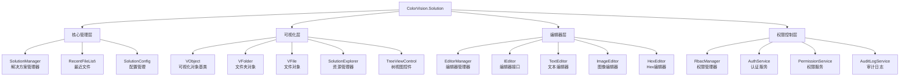
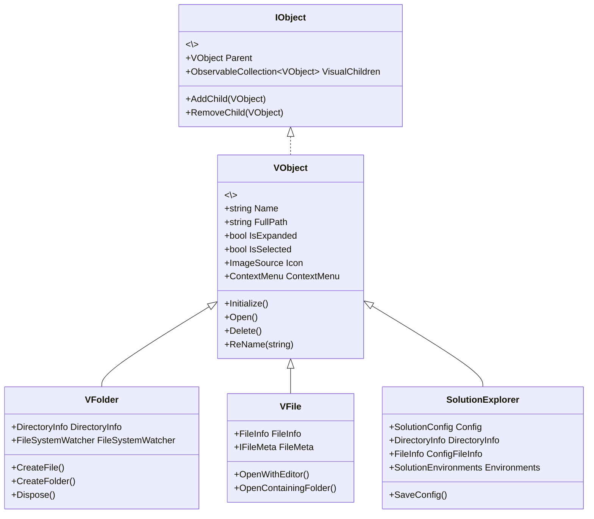
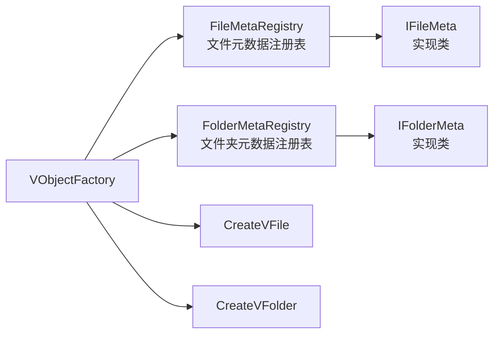

# ColorVision.Solution

## 目录
1. [概述](#概述)
2. [核心功能](#核心功能)
3. [架构设计](#架构设计)
4. [主要组件](#主要组件)
5. [文件管理](#文件管理)
6. [编辑器系统](#编辑器系统)
7. [权限控制](#权限控制)
8. [使用示例](#使用示例)
9. [最佳实践](#最佳实践)

## 概述

**ColorVision.Solution** 是 ColorVision 系统的解决方案管理组件，提供了工程文件的创建、打开、管理和编辑功能。它类似于 Visual Studio 的解决方案资源管理器，为用户提供了层次化的项目文件管理界面和丰富的文件操作功能。

### 基本信息

- **主要功能**: 解决方案管理、文件树视图、多编辑器支持、权限控制
- **UI 框架**: WPF TreeView + MVVM
- **特色功能**: 文件系统监控、最近文件、插件系统、RBAC权限管理
- **版本**: 1.3.8.5
- **目标框架**: .NET 8.0 / .NET 6.0

## 核心功能

### 1. 解决方案管理
- **创建解决方案**: 通过 `SolutionManager.CreateSolution()` 创建新的工程解决方案
- **打开解决方案**: 支持打开 .cvsln 格式的解决方案文件
- **自动保存**: 程序退出时自动保存解决方案配置
- **最近文件**: 维护最近打开的解决方案历史记录
- **命令行支持**: 支持通过 `-s` 参数指定解决方案路径

### 2. 文件树视图
- **层次化显示**: TreeView 控件展示文件夹和文件的树形结构
- **可视化对象模型**: 基于 VObject、VFile、VFolder 的 MVVM 架构
- **文件图标**: 根据文件类型自动显示对应图标
- **右键菜单**: 丰富的上下文菜单操作（剪切、复制、粘贴、删除、重命名等）
- **拖拽支持**: 支持从外部拖拽文件到解决方案

### 3. 文件系统监控
- **实时更新**: 使用 FileSystemWatcher 监控文件系统变化
- **自动刷新**: 文件创建、删除、修改时自动更新树视图
- **性能优化**: 延迟加载和批量更新减少界面卡顿

### 4. 编辑器系统
- **多编辑器支持**: 
  - TextEditor - 文本文件编辑
  - ImageEditor - 图像查看和编辑
  - HexEditor - 二进制文件编辑
  - WebEditor - Web内容查看
  - AvalonEdit - 代码编辑器（支持语法高亮）
- **编辑器注册**: 通过 `EditorForExtensionAttribute` 特性自动注册
- **默认编辑器**: 可配置每种文件类型的默认编辑器
- **编辑器选择**: 支持"打开方式"功能选择编辑器

### 5. 权限控制（RBAC）
- **用户管理**: 用户注册、登录、权限验证
- **角色管理**: 基于角色的访问控制
- **权限管理**: 细粒度的文件和操作权限控制
- **审计日志**: 记录用户操作日志

### 6. 搜索功能
- **文件搜索**: 在解决方案中搜索文件名
- **搜索视图**: SolutionView 提供搜索界面
- **快速定位**: 支持快速定位到搜索结果

## 架构设计

### 整体架构



### 类层次结构



### 工厂模式



## 主要组件

### SolutionManager 解决方案管理器

解决方案的中央管理器，负责创建、打开、保存解决方案。

```csharp
public class SolutionManager : ViewModelBase
{
    // 单例实例
    public static SolutionManager GetInstance();
    
    // 解决方案历史记录
    public RecentFileList SolutionHistory { get; set; }
    
    // 当前打开的解决方案集合
    public ObservableCollection\<SolutionExplorer\> SolutionExplorers { get; set; }
    
    // 当前活动的解决方案
    public SolutionExplorer CurrentSolutionExplorer { get; set; }
    
    // 解决方案环境变量
    public SolutionEnvironments SolutionEnvironments { get; set; }
    
    // 事件
    public event EventHandler SolutionCreated;
    public event EventHandler SolutionLoaded;
    
    // 方法
    public bool OpenSolution(string fullPath);
    public bool CreateSolution(string solutionDirectoryPath);
    public void NewCreateWindow();
}
```

**主要职责**:
- 管理解决方案的生命周期
- 维护最近打开的解决方案列表
- 处理命令行参数启动
- 集成 JumpList 支持

### SolutionExplorer 解决方案资源管理器

表示一个打开的解决方案，继承自 VObject。

```csharp
public class SolutionExplorer : VObject
{
    // 解决方案目录信息
    public DirectoryInfo DirectoryInfo { get; private set; }
    
    // 解决方案配置
    public SolutionConfig Config { get; private set; }
    
    // 配置文件信息
    public FileInfo ConfigFileInfo { get; private set; }
    
    // 解决方案环境变量
    public SolutionEnvironments SolutionEnvironments { get; }
    
    // 驱动器信息
    public DriveInfo DriveInfo { get; private set; }
    
    // 命令
    public RelayCommand OpenFileInExplorerCommand { get; }
    public RelayCommand SaveCommand { get; }
    public RelayCommand EditCommand { get; }
    public RelayCommand AddDirCommand { get; }
    
    // 方法
    private void InitializeSolution();
    private void InitializeFileSystemWatcher();
    private void SaveConfig();
}
```

**核心功能**:
- 加载解决方案配置（.cvsln 文件）
- 初始化文件系统监控
- 管理解决方案的可视化子节点
- 监控磁盘空间

### VObject 可视化对象基类

所有树视图项的基类，实现了 IObject 和 INotifyPropertyChanged。

```csharp
public class VObject : INotifyPropertyChanged, IObject
{
    // 基本属性
    public VObject Parent { get; set; }
    public virtual string Name { get; set; }
    public virtual string FullPath { get; set; }
    public virtual ImageSource Icon { get; set; }
    public virtual bool IsExpanded { get; set; }
    public virtual bool IsSelected { get; set; }
    public virtual bool IsEditMode { get; set; }
    
    // 子节点
    public virtual ObservableCollection\<VObject\> VisualChildren { get; set; }
    
    // 上下文菜单
    public ContextMenu ContextMenu { get; set; }
    public List\\<MenuItemMetadata\> MenuItemMetadatas { get; set; }
    
    // 命令
    public RelayCommand OpenCommand { get; set; }
    public RelayCommand DeleteCommand { get; set; }
    public RelayCommand PropertyCommand { get; set; }
    public RelayCommand CopyFullPathCommand { get; set; }
    
    // 虚方法
    public virtual void Initialize();
    public virtual void Open();
    public virtual void Delete();
    public virtual bool ReName(string name);
    public virtual void InitContextMenu();
    public virtual void InitMenuItem();
}
```

**设计模式**:
- 组合模式：通过 Parent 和 VisualChildren 构建树形结构
- 命令模式：使用 RelayCommand 封装操作
- 模板方法：提供虚方法供子类重写

### VFolder 文件夹对象

表示文件系统中的一个文件夹。

```csharp
public class VFolder : VObject, IDisposable
{
    // 文件夹信息
    public DirectoryInfo DirectoryInfo { get; set; }
    
    // 文件夹元数据
    public IFolderMeta FolderMeta { get; set; }
    
    // 文件系统监控器
    public FileSystemWatcher FileSystemWatcher { get; set; }
    
    // 命令
    public RelayCommand OpenFolderCommand { get; set; }
    public RelayCommand OpenContainingFolderCommand { get; set; }
    public RelayCommand CreatFileCommand { get; set; }
    public RelayCommand CreatDirCommand { get; set; }
    
    // 构造函数
    public VFolder(IFolderMeta folderMeta);
    
    // 方法
    private void InitializeFileSystemWatcher();
    public void Dispose();
}
```

**核心功能**:
- 监控文件夹内容变化（FileSystemWatcher）
- 处理文件和文件夹的创建、删除、重命名事件
- 提供文件夹特定的右键菜单操作
- 实现 IDisposable 正确释放资源

### VFile 文件对象

表示文件系统中的一个文件。

```csharp
public class VFile : VObject
{
    // 文件信息
    public FileInfo FileInfo { get; set; }
    
    // 文件元数据
    public IFileMeta FileMeta { get; set; }
    
    // 命令
    public RelayCommand OpenContainingFolderCommand { get; set; }
    public RelayCommand OpenMethodCommand { get; set; }
    
    // 构造函数
    public VFile(IFileMeta fileMeta);
    
    // 方法
    public override void Open();
    private void OpenMethod();
}
```

**核心功能**:
- 根据文件类型显示对应图标
- 双击打开文件（使用默认编辑器）
- 支持"打开方式"选择编辑器
- 提供文件特定的右键菜单操作

## 文件管理

### 文件元数据系统

ColorVision.Solution 使用元数据系统来扩展文件和文件夹的行为。

```csharp
// 文件元数据接口
public interface IFileMeta
{
    string Name { get; }
    string FullName { get; }
    ImageSource Icon { get; }
    FileInfo FileInfo { get; }
}

// 文件夹元数据接口
public interface IFolderMeta
{
    string Name { get; }
    string FullName { get; }
    ImageSource Icon { get; }
    DirectoryInfo DirectoryInfo { get; }
}
```

### 工厂模式

使用工厂模式创建文件和文件夹对象：

```csharp
public class VObjectFactory
{
    // 创建文件对象
    public static VFile CreateVFile(FileInfo fileInfo)
    {
        var fileMeta = FileMetaRegistry.GetFileMeta(fileInfo);
        return new VFile(fileMeta);
    }
    
    // 创建文件夹对象
    public static VFolder CreateVFolder(DirectoryInfo directoryInfo)
    {
        var folderMeta = FolderMetaRegistry.GetFolderMeta(directoryInfo);
        return new VFolder(folderMeta);
    }
}
```

### 注册表模式

元数据通过注册表进行管理：

```csharp
// 文件元数据注册表
public class FileMetaRegistry
{
    private static Dictionary\\<string, Type\> _registry = new();
    
    public static void Register(string extension, Type fileMetaType)
    {
        _registry[extension.ToLowerInvariant()] = fileMetaType;
    }
    
    public static IFileMeta GetFileMeta(FileInfo fileInfo)
    {
        var ext = fileInfo.Extension.ToLowerInvariant();
        if (_registry.TryGetValue(ext, out var type))
        {
            return (IFileMeta)Activator.CreateInstance(type, fileInfo);
        }
        return new CommonFile(fileInfo); // 默认实现
    }
}
```

## 编辑器系统

### EditorManager 编辑器管理器

管理所有编辑器的注册和分配。

```csharp
public class EditorManager
{
    public static EditorManager Instance { get; }
    
    // 扩展名 -> 编辑器类型列表
    private readonly Dictionary\<string, List\\<Type>\> _editorMappings;
    
    // 扩展名 -> 默认编辑器类型
    private readonly Dictionary\\<string, Type\> _defaultEditors;
    
    // 通用编辑器列表
    private readonly List\\<Type\> _genericEditorTypes;
    
    // 获取文件的所有可用编辑器
    public List\\<IEditor\> GetEditorsForFile(string filePath);
    
    // 获取文件的默认编辑器
    public IEditor GetDefaultEditor(string extension);
    
    // 设置默认编辑器
    public void SetDefaultEditor(string extension, Type editorType);
    
    // 注册编辑器（通过特性自动调用）
    private void RegisterEditors();
}
```

### 编辑器特性

使用特性标记编辑器支持的文件类型：

```csharp
// 标记编辑器支持的文件扩展名
[AttributeUsage(AttributeTargets.Class)]
public class EditorForExtensionAttribute : Attribute
{
    public string[] Extensions { get; }
    
    public EditorForExtensionAttribute(params string[] extensions)
    {
        Extensions = extensions;
    }
}

// 标记通用编辑器（支持所有文件类型）
[AttributeUsage(AttributeTargets.Class)]
public class GenericEditorAttribute : Attribute
{
}
```

### 内置编辑器

#### TextEditor - 文本编辑器
```csharp
[EditorForExtension(".txt", ".log", ".md", ".json", ".xml")]
public class TextEditor : EditorBase
{
    public override void Open(string filePath)
    {
        // 使用系统默认程序打开文本文件
        Process.Start(new ProcessStartInfo(filePath) 
        { 
            UseShellExecute = true 
        });
    }
}
```

#### ImageEditor - 图像编辑器
```csharp
[EditorForExtension(".png", ".jpg", ".jpeg", ".bmp", ".gif")]
public class ImageEditor : EditorBase
{
    public override void Open(string filePath)
    {
        // 使用 ColorVision 的图像查看器
        var imageWindow = new ImageViewWindow(filePath);
        imageWindow.Show();
    }
}
```

#### AvalonEdit - 代码编辑器
```csharp
[EditorForExtension(".cs", ".xaml", ".cpp", ".h", ".py")]
public class AvalonEditWindow : EditorBase
{
    public override void Open(string filePath)
    {
        var editor = new AvalonEditWindow();
        editor.LoadFile(filePath);
        editor.Show();
    }
}
```

#### HexEditor - 十六进制编辑器
```csharp
[GenericEditor] // 支持所有文件类型
public class HexEditor : EditorBase
{
    public override void Open(string filePath)
    {
        var hexView = new HexEditorView(filePath);
        hexView.Show();
    }
}
```

### 编辑器选择

用户可以选择用哪个编辑器打开文件：

```csharp
// 显示编辑器选择窗口
public void ShowEditorSelection(string filePath)
{
    var editors = EditorManager.Instance.GetEditorsForFile(filePath);
    
    if (editors.Count == 0)
    {
        MessageBox.Show("没有找到支持此文件类型的编辑器");
        return;
    }
    
    if (editors.Count == 1)
    {
        // 只有一个编辑器，直接打开
        editors[0].Open(filePath);
        return;
    }
    
    // 显示编辑器选择窗口
    var selectionWindow = new EditorSelectionWindow(editors, filePath);
    if (selectionWindow.ShowDialog() == true)
    {
        var selectedEditor = selectionWindow.SelectedEditor;
        selectedEditor.Open(filePath);
        
        // 可选：记住用户的选择
        if (selectionWindow.RememberChoice)
        {
            var ext = Path.GetExtension(filePath);
            EditorManager.Instance.SetDefaultEditor(ext, selectedEditor.GetType());
        }
    }
}
```

## 权限控制

ColorVision.Solution 集成了完整的 RBAC (Role-Based Access Control) 权限管理系统。

### 核心组件

```csharp
// RBAC 管理器
public class RbacManager
{
    public static RbacManager Instance { get; }
    
    // 当前登录用户
    public UserEntity CurrentUser { get; set; }
    
    // 认证服务
    public IAuthService AuthService { get; }
    
    // 检查权限
    public bool HasPermission(string permissionCode);
    
    // 检查角色
    public bool HasRole(string roleCode);
}

// 认证服务接口
public interface IAuthService
{
    Task\<LoginResultDto\> LoginAsync(string username, string password);
    Task\<bool\> RegisterAsync(UserEntity user, string password);
    Task LogoutAsync();
    Task\<bool\> ChangePasswordAsync(string oldPassword, string newPassword);
}

// 权限服务
public class PermissionService
{
    public List\\<PermissionEntity\> GetUserPermissions(int userId);
    public bool HasPermission(int userId, string permissionCode);
    public void GrantPermission(int userId, string permissionCode);
    public void RevokePermission(int userId, string permissionCode);
}

// 审计日志服务
public class AuditLogService
{
    public void LogAction(string action, string details);
    public List\\<AuditLogEntity\> GetUserLogs(int userId);
    public List\\<AuditLogEntity\> GetSystemLogs(DateTime from, DateTime to);
}
```

### 使用示例

```csharp
// 登录
var authService = RbacManager.Instance.AuthService;
var result = await authService.LoginAsync("username", "password");
if (result.Success)
{
    Console.WriteLine($"登录成功: {result.User.Username}");
}

// 检查权限
if (RbacManager.Instance.HasPermission("FILE_DELETE"))
{
    // 允许删除文件
    DeleteFile(filePath);
}
else
{
    MessageBox.Show("您没有删除文件的权限");
}

// 记录操作日志
var auditService = new AuditLogService();
auditService.LogAction("FILE_DELETE", $"删除文件: {filePath}");
```

## 使用示例

### 1. 基础解决方案管理

```csharp
using ColorVision.Solution;
using ColorVision.Solution.V;

// 获取解决方案管理器
var solutionManager = SolutionManager.GetInstance();

// 监听解决方案事件
solutionManager.SolutionCreated += (sender, args) =>
{
    Console.WriteLine($"解决方案已创建: {args}");
};

solutionManager.SolutionLoaded += (sender, args) =>
{
    Console.WriteLine($"解决方案已加载: {args}");
};

// 创建新解决方案
string solutionPath = @"D:\Projects\MyColorVisionProject";
solutionManager.CreateSolution(solutionPath);

// 打开现有解决方案
string existingSolution = @"D:\Projects\ExistingProject\ExistingProject.cvsln";
bool success = solutionManager.OpenSolution(existingSolution);

// 访问当前解决方案
var currentSolution = solutionManager.CurrentSolutionExplorer;
Console.WriteLine($"当前解决方案: {currentSolution.Name}");
Console.WriteLine($"解决方案目录: {currentSolution.DirectoryInfo.FullName}");
```

### 2. 使用树视图控件

```xaml
<!-- XAML 中使用 TreeViewControl -->
<Window x:Class="MyApp.MainWindow"
        xmlns="http://schemas.microsoft.com/winfx/2006/xaml/presentation"
        xmlns:x="http://schemas.microsoft.com/winfx/2006/xaml"
        xmlns:solution="clr-namespace:ColorVision.Solution;assembly=ColorVision.Solution">
    \<Grid\>
        <solution:TreeViewControl x:Name="SolutionTreeView" />
    </Grid>
</Window>
```

```csharp
// 代码中使用
public partial class MainWindow : Window
{
    public MainWindow()
    {
        InitializeComponent();
        // TreeViewControl 会自动绑定到 SolutionManager.SolutionExplorers
    }
}
```

### 3. 注册自定义编辑器

```csharp
using ColorVision.Solution.Editor;

// 创建自定义编辑器
[EditorForExtension(".myext", ".data")]
public class MyCustomEditor : EditorBase
{
    public override void Open(string filePath)
    {
        // 实现自定义打开逻辑
        var window = new MyCustomEditorWindow();
        window.LoadFile(filePath);
        window.Show();
    }
    
    public override string DisplayName => "我的自定义编辑器";
    public override string Description => "用于打开 .myext 和 .data 文件";
}

// 创建通用编辑器（支持所有文件类型）
[GenericEditor]
public class UniversalViewer : EditorBase
{
    public override void Open(string filePath)
    {
        // 通用查看器逻辑
    }
}
```

### 4. 文件元数据自定义

```csharp
using ColorVision.Solution.FileMeta;
using ColorVision.Solution.FolderMeta;

// 注册自定义文件元数据
public class CustomFileMeta : IFileMeta
{
    public FileInfo FileInfo { get; }
    public string Name => FileInfo.Name;
    public string FullName => FileInfo.FullName;
    public ImageSource Icon { get; }
    
    public CustomFileMeta(FileInfo fileInfo)
    {
        FileInfo = fileInfo;
        Icon = LoadCustomIcon(); // 自定义图标加载
    }
    
    private ImageSource LoadCustomIcon()
    {
        // 根据文件内容或属性返回不同图标
        return new BitmapImage(new Uri("pack://application:,,,/MyApp;component/Icons/custom.png"));
    }
}

// 在应用启动时注册
FileMetaRegistry.Register(".myext", typeof(CustomFileMeta));
```

### 5. 文件系统监控

```csharp
// VFolder 自动监控文件系统变化
var solutionExplorer = SolutionManager.GetInstance().CurrentSolutionExplorer;

// 当文件被创建时，TreeView 会自动更新
// 这是通过 FileSystemWatcher 实现的

// 也可以手动监听变化事件
solutionExplorer.VisualChildrenEventHandler += (sender, e) =>
{
    Console.WriteLine("解决方案树结构已变化");
};
```

### 6. 搜索功能

```csharp
using ColorVision.Solution.Searches;

// 在解决方案中搜索文件
public void SearchFiles(string searchPattern)
{
    var solutionExplorer = SolutionManager.GetInstance().CurrentSolutionExplorer;
    var results = new List\\<VFile\>();
    
    void SearchRecursive(VObject node)
    {
        if (node is VFile file && file.Name.Contains(searchPattern, StringComparison.OrdinalIgnoreCase))
        {
            results.Add(file);
        }
        
        foreach (var child in node.VisualChildren)
        {
            SearchRecursive(child);
        }
    }
    
    SearchRecursive(solutionExplorer);
    
    Console.WriteLine($"找到 {results.Count} 个匹配的文件");
}
```

### 7. 命令行集成

```csharp
// 从命令行打开解决方案
// 运行: MyApp.exe -s "C:\Projects\MySolution\MySolution.cvsln"

// 这在 SolutionManager 构造函数中自动处理：
var parser = ArgumentParser.GetInstance();
parser.AddArgument("solutionpath", false, "s");
parser.Parse();
var solutionpath = parser.GetValue("solutionpath");
if (solutionpath != null)
{
    OpenSolution(solutionpath);
}
```

## 最佳实践

### 1. 性能优化

```csharp
// ✅ 推荐：使用延迟加载
public async Task LoadLargeSolution()
{
    // VMUtil 使用批量延迟加载避免界面冻结
    await VMUtil.Instance.GeneralChild(solutionExplorer, directoryInfo);
}

// ❌ 避免：一次性加载所有文件
public void LoadAllFilesAtOnce()
{
    // 这会导致大型项目加载时界面卡顿
    foreach (var file in Directory.GetFiles(path, "*.*", SearchOption.AllDirectories))
    {
        CreateFile(file);
    }
}

// ✅ 使用批处理和延迟
int i = 0;
foreach (var item in directoryInfo.GetFiles())
{
    i++;
    if (i == 100) // 每100个文件延迟一次
    {
        await Task.Delay(100);
        i = 0;
    }
    CreateFile(item);
}
```

### 2. 资源管理

```csharp
// ✅ 正确释放 FileSystemWatcher
public class VFolder : VObject, IDisposable
{
    private FileSystemWatcher _watcher;
    
    public void Dispose()
    {
        if (_watcher != null)
        {
            _watcher.EnableRaisingEvents = false;
            _watcher.Dispose();
            _watcher = null;
        }
    }
}

// ✅ 在应用退出时保存配置
AppDomain.CurrentDomain.ProcessExit += (_, __) => 
{
    solutionExplorer.SaveConfig();
};
```

### 3. 错误处理

```csharp
// ✅ 完善的异常处理
public override bool ReName(string newName)
{
    try
    {
        if (string.IsNullOrWhiteSpace(newName))
        {
            ShowUserError("文件名不能为空");
            return false;
        }
        
        var newPath = Path.Combine(DirectoryInfo.Parent.FullName, newName);
        
        if (File.Exists(newPath))
        {
            ShowUserError("文件已存在");
            return false;
        }
        
        DirectoryInfo.MoveTo(newPath);
        LogOperation($"重命名: {Name} -> {newName}");
        return true;
    }
    catch (UnauthorizedAccessException)
    {
        ShowUserError("没有权限重命名此文件");
        LogError("重命名失败：权限不足");
        return false;
    }
    catch (IOException ex)
    {
        ShowUserError($"重命名失败：{ex.Message}");
        LogError("重命名失败", ex);
        return false;
    }
}
```

### 4. UI响应性

```csharp
// ✅ 在 UI 线程上更新界面
FileSystemWatcher.Created += (s, e) =>
{
    Application.Current?.Dispatcher.Invoke(() =>
    {
        VMUtil.Instance.CreateFile(this, new FileInfo(e.FullPath));
    });
};

// ✅ 使用异步操作
public async Task LoadSolutionAsync(string path)
{
    await Task.Run(() =>
    {
        // 在后台线程执行耗时操作
        var files = Directory.GetFiles(path, "*.*", SearchOption.AllDirectories);
        
        // 切换回 UI 线程更新界面
        Application.Current.Dispatcher.Invoke(() =>
        {
            foreach (var file in files)
            {
                AddFile(file);
            }
        });
    });
}
```

### 5. 内存管理

```csharp
// ✅ 使用弱引用避免内存泄漏
public class SolutionExplorer : VObject
{
    private WeakReference\<FileSystemWatcher\> _watcherRef;
    
    // 及时清理事件订阅
    public void Cleanup()
    {
        if (_watcherRef != null && _watcherRef.TryGetTarget(out var watcher))
        {
            watcher.EnableRaisingEvents = false;
            watcher.Dispose();
        }
    }
}
```

### 6. 可扩展性

```csharp
// ✅ 使用工厂模式和注册表模式
// 允许插件注册自定义文件类型
FileMetaRegistry.Register(".myext", typeof(MyCustomFileMeta));
EditorManager.Instance.SetDefaultEditor(".myext", typeof(MyCustomEditor));

// ✅ 使用事件进行解耦
solutionManager.SolutionLoaded += OnSolutionLoaded;

private void OnSolutionLoaded(object sender, EventArgs e)
{
    // 插件可以响应解决方案加载事件
    InitializePluginFeatures();
}
```

### 7. 安全性

```csharp
// ✅ 验证文件路径
public bool IsValidPath(string path)
{
    try
    {
        var fullPath = Path.GetFullPath(path);
        var solutionDir = solutionExplorer.DirectoryInfo.FullName;
        
        // 确保路径在解决方案目录内
        return fullPath.StartsWith(solutionDir, StringComparison.OrdinalIgnoreCase);
    }
    catch
    {
        return false;
    }
}

// ✅ 使用权限检查
if (!RbacManager.Instance.HasPermission("FILE_DELETE"))
{
    ShowUserError("您没有删除文件的权限");
    return;
}
```

## 常见问题

### Q1: 如何处理大型解决方案的性能问题？

**A**: 使用以下策略：
- 启用延迟加载（VMUtil 已实现）
- 限制同时加载的文件数量
- 使用虚拟化 TreeView
- 禁用不必要的 FileSystemWatcher

### Q2: 如何自定义文件图标？

**A**: 实现 IFileMeta 接口并注册：
```csharp
public class MyFileMeta : IFileMeta
{
    public ImageSource Icon => new BitmapImage(new Uri("path/to/icon.png"));
}
FileMetaRegistry.Register(".myext", typeof(MyFileMeta));
```

### Q3: 如何添加自定义右键菜单项？

**A**: 重写 `InitMenuItem` 方法：
```csharp
public override void InitMenuItem()
{
    base.InitMenuItem();
    MenuItemMetadatas.Add(new MenuItemMetadata
    {
        Header = "自定义操作",
        Command = new RelayCommand(MyCustomAction),
        Order = 150
    });
}
```

---

*ColorVision.Solution 为 ColorVision 系统提供了强大的工程管理功能，通过直观的文件树界面、丰富的编辑器支持和完善的权限控制，帮助用户高效地管理项目文件和资源。*